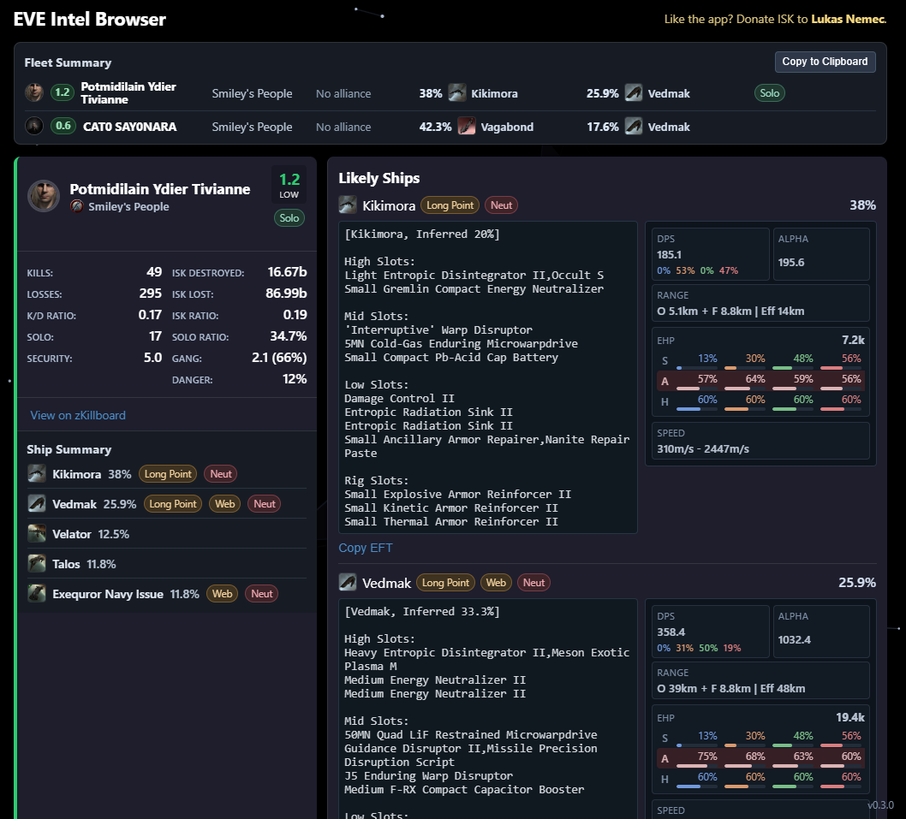

# EVE Intel (Web + Desktop)

> ⚠️ **DISCLAIMER: AI GENERATED CODE**
>
> This project, including all source code, logic, and documentation, was generated by an
> Artificial Intelligence model. While efforts have been made to ensure functionality and
> safety, it should be reviewed before use in production environments. Use at your own risk.

[](./screen.png)

Browser-first EVE Online intel app inspired by EVE Squadron / EVEOS workflows, with an optional Electron desktop wrapper for better clipboard automation.

**Like the app?** Donate ISK to [Lukas Nemec](https://zkillboard.com/character/93227004/).

## Overview

This project provides:

- A fast React + TypeScript web app for local intel parsing and enrichment
- Progressive zKill + ESI enrichment (results appear quickly, then improve)
- Ship likelihood inference from kills + losses
- Cyno and bait risk signals
- Role badges/icons (bubble, HIC, boosh, logi class, etc.)
- Fit inference from recent losses in EFT format
- Dogma-based combat estimates per inferred fit (DPS, alpha, damage split, range, EHP, resists)
- Local cache for faster repeated lookups
- Optional desktop build (`.exe`) with native clipboard polling

## Core Features

## Input and Parsing

The app accepts multiple paste formats and deduplicates pilots:

- Pilot only:
  - `Pilot Alpha`
- Pilot + explicit ship:
  - `Pilot Alpha (Venture)`
- Chat log style (`name after first >`):
  - `[15:08:27] Scout Lead > Pilot Bravo`
- URL-tag style (`name from <url=...>name</url>` after first `>`):
  - `[14:49:21] Scout Lead > <url=showinfo:...>Pilot Charlie</url> <url=showinfo:...>Pilot Delta</url>`

Rules:

- Explicit ship overrides inference and is treated as 100%
- Duplicate pilots are merged (explicit entry wins over inferred entry)
- Invalid lines are rejected and can be shown in debug logs

## Intel Pipeline (Progressive)

For each pilot:

1. Resolve character ID from ESI
2. Fetch character profile and zKill windowed kills/losses
3. Compute stage-1 ship inference quickly
4. Fetch deeper paged zKill history
5. Recompute stage-2 inference with more evidence

UI updates continuously as data arrives. You do not need to wait for full deep-history completion.

## Ship Likelihood Inference

Inference is based on both:

- Recent kills where pilot appears as attacker (their flown ship)
- Recent losses where pilot is victim (their lost ship)

Scoring model:

- Recency decay (newer events weigh more)
- Loss events weighted slightly higher than kill events
- Probabilities normalized to 100%
- Capsule/pod candidates are filtered out from final candidates
- 0% candidates are filtered out

If explicit ship is pasted:

- Only that ship is shown at 100%

## Fit Inference (EFT)

For predicted ships, fits are inferred from pilot losses on that hull:

- Item flags are used to classify high/mid/low/rig/cargo/other
- Candidate signatures are aggregated by frequency
- Most frequent signature becomes primary fit
- Alternatives and confidence are retained
- Output rendered in EFT-like sections

`Copy EFT` is hidden when:

- fit is unknown
- ship is capsule/pod-like

## Dogma-Based Combat Estimates

When fit/module evidence is available, each fit row now includes:

- `DPS` and `alpha`
- damage distribution (`EM / TH / KI / EX`)
- engagement range (`optimal`, `falloff`, effective band)
- EHP estimate and resist profile (`shield / armor / hull`)
- confidence score + assumptions tooltip

Data source/model:

- Build-time static dogma pack generated from Fuzzwork static data (CSV tables)
- Runtime calculator uses conservative defaults whenever module/ammo/script detail is incomplete
- Estimates are directional and not guaranteed pyfa-exact

If dogma data is unavailable at runtime:

- fit still renders
- combat metrics panel shows `Unavailable`
- debug log records loader error/version context

## Cyno + Bait Risk

Cyno logic combines:

- hull capability whitelist
- fitted cyno evidence in losses
- global cyno evidence trends per pilot

Signals:

- `Potential Cyno`
- `Bait`
- red-tinted highlight when cyno chance is high enough

## Role Badges / Icons

Role detection uses fit evidence + fitted loss modules (cargo ignored):

- Long Point
- Web
- Bubble
- HIC
- Boosh
- Neut
- Cloaky
- Shield Logi
- Armor Logi

Current special mappings requested in UI:

- HIC icon: `37611`
- Bubble icon: `22778`
- Neut icon: `16469`
- Cloaky icon: `11370`
- Shield Logi icon: `8635`
- Armor Logi icon: `16455`

## Fleet Summary + Detailed Cards

- Compact fleet summary appears when multiple pilots are present
- Character cards include:
  - portrait
  - pilot/corp/alliance links to zKill pages
  - stats (kills/losses/KD/ISK/etc.)
  - ship summary row
  - detailed candidate list with fit + role/cyno/bait indicators

## Caching

Uses browser `localStorage` for:

- zKill lists
- zKill stats
- hydrated killmail details
- derived inference snapshots
- user settings and debug toggle

Includes `Wipe Cache` action in UI.

## Browser vs Desktop Mode

## Browser Mode

- Pure frontend
- Immediate processing on paste event (`Ctrl+V`)
- Manual entry field + submit supported

## Desktop Mode (Electron)

- Uses native clipboard polling bridge
- Better continuous clipboard behavior than browser security model
- External links open in system browser
- Frameless themed window controls supported

## Tech Stack

- Vite
- React 18
- TypeScript
- Vitest + Testing Library
- Electron (wrapper)
- electron-builder (Windows packaging, NSIS)

## Prerequisites

- Node.js 18+ (Node 20+ recommended)
- npm
- Windows recommended for `.exe` packaging
- GitHub CLI (`gh`) for local release publishing

PowerShell note (if script execution blocks `npm.ps1`):

```powershell
cmd /c npm install
```

## Install

```bash
npm install
```

## Run (Web)

Development:

```bash
npm run dev
```

Open `http://localhost:5173`.

Production preview:

```bash
npm run build
npm run preview
```

## Run (Desktop/Electron)

Dev mode (2 terminals):

Terminal 1:

```bash
npm run desktop:dev:web
```

Terminal 2:

```bash
npm run desktop:dev:app
```

Run desktop against production build:

```bash
npm run desktop:run
```

## Build Windows Executable

Unpacked output:

```bash
npm run desktop:pack
```

Output:

- `release/win-unpacked/`

## Static Dogma Data Pipeline

Manual commands:

```bash
npm run sde:sync
npm run sde:compile
npm run sde:prepare
```

Behavior:

- `sde:sync` downloads/refreshes Fuzzwork raw CSV into `data/sde/raw/<version>/` and updates `data/sde/.manifest.json`
- `sde:compile` compiles a runtime pack into:
  - `public/data/dogma-pack.<version>.json`
  - `public/data/dogma-manifest.json`
- `prebuild` runs `sde:prepare` automatically

Installer (`.exe`):

```bash
npm run desktop:dist
```

Output:

- `release/EVE Intel Setup <version>.exe`
- `release/EVE Intel Setup <version>.exe.blockmap`
- `release/win-unpacked/`

## Build Linux / macOS Artifacts

Linux:

```bash
npm run desktop:dist:linux
```

macOS Apple Silicon (arm64):

```bash
npm run desktop:dist:mac:arm64
```

Notes:

- In practice, build each platform on that platform (Windows on Windows, Linux on Linux, macOS on macOS).
- Cross-building desktop binaries is limited and often unreliable (especially macOS signing/notarization from non-macOS).

## Create/Update GitHub Release Locally

This flow can run in two modes:

- Host-scoped (default): build/verify/upload only targets supported by the current OS
- Full (`--full`): require all platforms before publishing

Prerequisites:

1. Install and authenticate GitHub CLI:
   - `gh auth login`
2. Ensure you have push/release permissions for the target repository.

Host-scoped build + verify + upload (default):

```bash
npm run release:github
```

What it does:

1. Checks required artifacts for current version for targets supported by current host OS:
   - Windows installer (`.exe`)
   - Linux (`.AppImage`, `.tar.gz`)
   - macOS arm64 (`.dmg`, `.zip`)
2. Builds missing targets by running:
   - `desktop:dist:win`
   - `desktop:dist:linux`
   - `desktop:dist:mac:arm64`
   - Auto-build only runs for targets supported on the current host OS:
     - Windows host -> Windows target
     - Linux host -> Linux target
     - macOS host -> macOS target
3. Verifies required artifacts for current mode are present before release creation/upload
4. Scans `release/` for current-version artifacts and `.yml` metadata
5. Creates a release for tag `v<package.json version>` if missing
6. Or uploads and overwrites artifacts on existing release tag

Strict all-platform mode:

```bash
npm run release:github:full
```

In full mode, release upload fails unless Windows + Linux + macOS arm64 artifacts all exist.

Windows build + upload shortcut:

```bash
npm run release:github:win
```

Optional custom tag:

```bash
node scripts/publish-github-release.mjs v0.2.2
```

## Test

Run all tests:

```bash
npm test -- --run
```

Watch mode:

```bash
npm run test:watch
```

Update snapshots:

```bash
npm test -- --run -u
```

## Scripts Reference

- `npm run dev` - web dev server
- `npm run sde:sync` - refresh cached static dogma raw data
- `npm run sde:compile` - compile runtime dogma pack
- `npm run sde:prepare` - sync + compile dogma pack
- `npm run sde:refresh` - alias of `sde:prepare`
- `npm run build` - TypeScript build + Vite build
- `npm run preview` - preview built web output
- `npm run test` - run tests
- `npm run test:watch` - test watch mode
- `npm run backtest:zkill` - run zKill backtest utility
- `npm run desktop:dev:web` - web server for desktop dev
- `npm run desktop:dev:app` - Electron app against dev server
- `npm run desktop:run` - Electron app against built frontend
- `npm run desktop:pack` - unpacked desktop bundle
- `npm run desktop:dist` - Windows installer
- `npm run desktop:dist:win` - Windows installer
- `npm run desktop:dist:linux` - Linux packages
- `npm run desktop:dist:mac:arm64` - macOS Apple Silicon packages
- `npm run release:github` - build locally and publish artifacts to GitHub Release
- `npm run release:github:full` - require all platform artifacts before upload
- `npm run release:github:win` - build Windows artifacts then upload release assets

## Troubleshooting

## `npm.ps1` blocked in PowerShell

Use:

```powershell
cmd /c npm <command>
```

## Electron opens blank screen

Check:

1. `npm run build` succeeds
2. `dist/index.html` exists
3. `electron/main.cjs` exists
4. App console for missing asset paths

## zKill lookback limits

zKill `pastSeconds` is capped; this app clamps windowed lookback to supported max and uses fallback endpoints for broader inference.

## Clipboard behavior differs between browser and desktop

- Browser security model limits continuous clipboard reads
- Desktop wrapper uses Electron native clipboard API

## Auto-update behavior (desktop)

- Desktop builds use `electron-updater` against GitHub Releases
- App checks for updates automatically (startup + periodic checks)
- When update is available it downloads in background
- When download is complete, use `Restart to Update` in app (or just close/reopen)
- Differential update metadata (`latest.yml` + `.blockmap`) must be present in release assets for best update behavior on Windows

## Project Structure

- `src/` - frontend source
- `src/lib/parser.ts` - paste parsing formats
- `src/lib/intel.ts` - ship/fits/stats inference
- `src/lib/cyno.ts` - cyno + bait heuristics
- `src/lib/roles.ts` - role badge inference
- `src/lib/api/zkill.ts` - zKill/ESI calls + hydration
- `electron/main.cjs` - Electron main process
- `electron/preload.cjs` - secure bridge (`window.eveIntelDesktop`)
- `DESKTOP_WRAPPER.md` - short desktop notes
- `package.json` - scripts and build config

## Security and Data Notes

- No backend service is required for normal usage
- Data is fetched from public ESI/zKill endpoints
- Cached data is stored locally in browser storage
- Do not paste sensitive non-game data into the intel field
