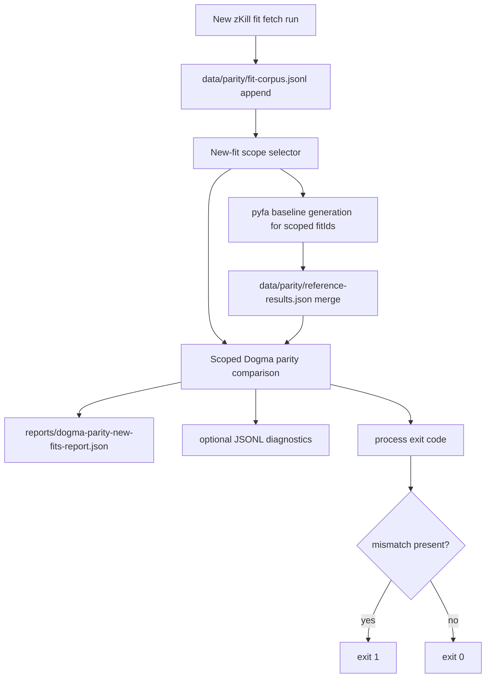
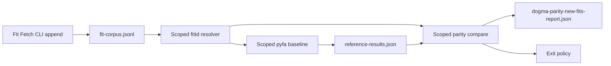

# Dogma New-Fit Failing Test Generation Design

## Overview
We need a continuation workflow that takes newly appended real-world zKill fit data and turns it into deterministic, reproducible Dogma parity failures using the existing parity fixture system.

The design intentionally reuses current parity artifacts and scripts so results are CI-compatible and low-friction:
- Canonical fit corpus: `data/parity/fit-corpus.jsonl`
- Reference metrics: `data/parity/reference-results.json`
- Golden ID set: `data/parity/golden-fit-ids.json`
- Existing parity comparison: `src/lib/dogma/parity/parity.test.ts`

Primary v1 goal:
- For newly appended fits only, automatically generate pyfa references, compare against Dogma, emit scoped failing artifacts, and exit non-zero on mismatch.

Non-goals for v1:
- Fixing Dogma calculations themselves
- Replacing the existing parity test architecture
- Creating per-fit standalone `*.test.ts` files

## Detailed Requirements
Consolidated from `specs/dogma-failing-test-generation/requirements.md`.

1. Workflow appends and consumes fits from the existing zKill parity corpus path:
- `data/parity/fit-corpus.jsonl`

2. Workflow is direct-append oriented:
- No candidate-staging file in v1

3. Workflow executes end-to-end in one command:
- pyfa baseline generation/import
- Dogma parity compare
- failing-case emission

4. Scope is limited to newly appended fits in the current run:
- do not regenerate failures for entire corpus by default

5. Failing-test representation is fixture-driven:
- deterministic vectors in existing parity fixture files
- no standalone per-fit source test files

6. Failure behavior:
- command exits non-zero by default when mismatches are found for newly appended fits

7. Reporting:
- write run artifact to `reports/dogma-parity-new-fits-report.json`
- optional JSONL diagnostics are supported

8. Existing parity architecture compatibility:
- must preserve compatibility with `fit-corpus.jsonl`, `reference-results.json`, and current parity comparison logic

## Architecture Overview
The continuation workflow extends the existing parity data path with a scoped orchestrator for newly appended fits.



## Components and Interfaces

### 1) New-Fit Scope Input
The workflow needs deterministic knowledge of which fit IDs were appended in the current run.

Interface contract (logical):
- Input source can be one of:
  - explicit `--fit-id` / `--fit-ids`
  - run manifest produced by the fetch command (recommended default path)
- Output: `newFitIds: string[]` de-duplicated and stable-sorted

### 2) Scoped Reference Sync
Reuses existing pyfa adapter/runtime patterns.

Responsibilities:
- Resolve corpus entries for `newFitIds`
- Generate pyfa metrics for each fit
- Merge results into `data/parity/reference-results.json`
- Record per-fit pyfa success/failure details

### 3) Scoped Parity Comparator
Compares Dogma vs pyfa only for `newFitIds` that have references.

Responsibilities:
- Parse EFT from corpus entries
- Compute Dogma metrics
- Compare with parity thresholds
- Produce deterministic mismatch list

### 4) Report Writer
Writes required machine-readable run result.

Required artifact:
- `reports/dogma-parity-new-fits-report.json`

Optional artifact:
- JSONL diagnostics for per-fit processing/comparison events

### 5) Exit Policy
Default behavior:
- Exit non-zero if any scoped mismatch exists
- Exit non-zero for fatal orchestration errors
- Exit zero only when scoped fits are processed and all compared fits pass

## Data Models

### Fit Corpus Entry (existing)
Source: `data/parity/fit-corpus.jsonl`

```ts
{
  fitId: string;
  shipTypeId: number;
  eft: string;
  origin: "zkill" | "manual" | "svcfitstat";
  tags: string[];
}
```

### New-Fit Run Scope (new logical model)

```ts
{
  runId: string;
  generatedAt: string; // ISO timestamp
  newFitIds: string[];
  source: "fetch-cli" | "manual-flags";
}
```

### Scoped Parity Report (required)
File: `reports/dogma-parity-new-fits-report.json`

```ts
{
  generatedAt: string;
  runId: string;
  scopedFitCount: number;
  comparedFitCount: number;
  mismatchCount: number;
  pyfaFailureCount: number;
  missingCorpusFitIds: string[];
  missingReferenceFitIds: string[];
  mismatches: Array<{
    fitId: string;
    shipTypeId: number;
    deltas: Array<{
      metric: string;
      actual: number;
      expected: number;
      absDelta: number;
      relDelta: number;
      pass: boolean;
    }>;
  }>;
  pyfaFailures: Array<{
    fitId: string;
    reason: string;
    stage?: string;
    stderrTail?: string;
  }>;
  exitCode: number;
}
```

### Optional Diagnostics JSONL
Each line represents one structured event:
- `fit-selected`
- `pyfa-run`
- `reference-merged`
- `comparison`
- `mismatch`
- `error`

## Error Handling

1. Missing scoped fit IDs in corpus:
- record in `missingCorpusFitIds`
- continue processing other fit IDs

2. pyfa execution failure per fit:
- record in `pyfaFailures`
- continue processing other fit IDs

3. EFT parse or Dogma compute failure per fit:
- record structured error event
- continue processing remaining fits

4. Report write failure:
- treated as fatal orchestration error
- immediate non-zero exit

5. Empty scoped input (no new fits):
- produce report with zero counts
- exit zero unless strict flag requires at least one fit

6. Mismatch policy:
- any mismatch in scoped compared fits sets default exit code to `1`

## Acceptance Criteria
All criteria are machine-verifiable and scoped to v1 behavior.

1. Given new fit IDs that exist in `data/parity/fit-corpus.jsonl`, when the workflow runs, then it processes only those fit IDs and does not compare unrelated corpus fits.

2. Given newly appended fits, when pyfa reference generation succeeds, then corresponding rows are merged into `data/parity/reference-results.json` deterministically by `fitId`.

3. Given scoped fits with pyfa references, when Dogma parity comparison runs, then `reports/dogma-parity-new-fits-report.json` is created with per-fit deltas and pass/fail status.

4. Given at least one scoped mismatch, when the command completes, then process exit code is non-zero.

5. Given no scoped mismatches and no fatal errors, when the command completes, then process exit code is zero.

6. Given per-fit partial failures (for example pyfa failures for some fits), when the command completes, then failures are captured in report fields and successful fits are still compared.

7. Given deterministic input scope and unchanged corpus/reference data, when the command is rerun, then mismatch output order and report semantics remain stable.

8. Given optional diagnostics enabled, when the command runs, then JSONL diagnostics are emitted with one structured event per processing step.

## Testing Strategy
TDD is mandatory for implementation work and follows red-green-blue gates.

### Unit Tests
- Scope parsing and normalization of fit IDs
- Report shaping and deterministic ordering
- Exit-code policy logic
- Error classification mapping

### Integration Tests
- Fixture-backed run over a small scoped set (including one intentional mismatch)
- Reference merge behavior into `reference-results.json`
- Partial-failure continuation behavior
- Report generation to `reports/dogma-parity-new-fits-report.json`

### Parity Workflow Tests
- Verify scoped comparison excludes non-scoped fits
- Verify mismatch produces non-zero exit
- Verify no-mismatch path produces zero exit

### Red/Green/Blue Success Gates
- Red gate:
  - Add failing tests for scoped-only comparison, mismatch exit policy, and report artifact contract.
- Green gate:
  - Implement minimal orchestration to make all new targeted tests pass.
- Blue gate:
  - Refactor shared parity helpers (if needed) without changing behavior; keep tests green.

## Appendices

### A) Technology Choices
- Reuse existing Node ESM scripts in `scripts/`
- Reuse pyfa adapter in `tools/parity/pyfa-adapter/`
- Reuse existing parity comparison types and logic in `src/lib/dogma/parity/`
- Keep fixture-first architecture; do not introduce a parallel test framework

### B) Research Findings Summary
Research source:
- `specs/dogma-failing-test-generation/research/dogma-fit-test-workflow.md`

Key conclusions:
- Existing parity is fixture-driven and CI-integrated.
- Canonical corpus is `data/parity/fit-corpus.jsonl`.
- Best continuation path is scoped orchestration over current fixture files, not per-fit source tests.

### C) Alternative Approaches Considered
1. Generate standalone per-fit `*.test.ts` files
- Rejected: duplicates parity logic and creates maintenance overhead.

2. Compare entire corpus every run
- Rejected: does not satisfy newly-appended scope requirement and increases noise/time.

3. Candidate staging file before corpus merge
- Rejected for v1 due to explicit requirement for direct append workflow.

### D) Component Relationship Diagram

