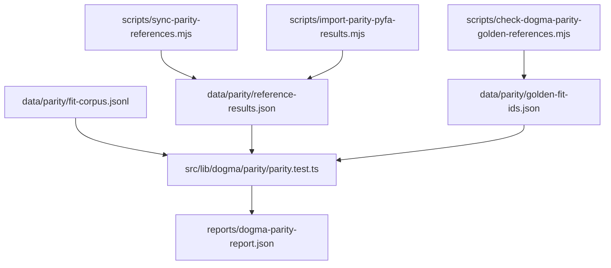

# Dogma Fit Test Workflow Research

Date: 2026-02-18

## Research Question
Should mismatch output for newly appended zKill fits generate deterministic vectors in existing parity fixtures, or standalone per-fit test files?

## Research Plan
1. Trace how current parity tests load and evaluate fit data.
2. Trace script-driven lifecycle for corpus, reference generation/import, and parity checks.
3. Identify canonical artifacts already used by CI/local workflows and decide the least-friction extension point.

## Findings

### 1) Parity tests are data-driven from shared fixtures
- `src/lib/dogma/parity/parity.test.ts` loads:
  - `data/parity/fit-corpus.jsonl`
  - `data/parity/reference-results.json`
  - `data/parity/golden-fit-ids.json`
- It computes app metrics from `fit-corpus` entries and compares against `reference-results`.
- In CI mode, it asserts zero failures and zero missing golden references.

### 2) Existing tooling already orbits fixture files, not generated test source files
- `scripts/build-dogma-fit-corpus.mjs` updates `data/parity/fit-corpus.jsonl`.
- `scripts/sync-parity-references.mjs` and `scripts/import-parity-pyfa-results.mjs` maintain `data/parity/reference-results.json`.
- `scripts/check-dogma-parity-golden-references.mjs` validates `data/parity/golden-fit-ids.json` consistency.
- No existing script generates standalone `*.test.ts` per fit.

### 3) Canonical target for fit appends is `data/parity/fit-corpus.jsonl`
- Parity tests and parity scripts point to `data/parity/fit-corpus.jsonl`.
- `data/parity/fit-corpus.dev.jsonl` is used by desktop runtime dump path, not the parity test pipeline.

## Architecture Snapshot


## Component Relationship
```mermaid
flowchart LR
  Z[New zKill Fit Fetch CLI] --> C1[Append new entries\nfit-corpus.jsonl]
  C1 --> P1[pyfa baseline generation/import]
  P1 --> R1[reference-results.json]
  C1 --> G1[golden-fit-ids.json update\n(new-fit scoped)]
  R1 --> T1[parity.test.ts comparison]
  G1 --> T1
  T1 --> O1[failing mismatch set\nfor newly appended fits]
```

## Recommendation
Use deterministic vectors in the existing shared parity fixtures (not standalone per-fit test files).

Why this fits current architecture:
- Reuses the active CI/local parity pipeline directly.
- Keeps all parity data in canonical artifacts already consumed by tests/scripts.
- Avoids introducing a parallel testing mechanism with duplicated logic.
- Makes generated failures reproducible from fixture deltas plus parity run.

## Practical Implication for Continuation Spec
For newly appended fits, the workflow should:
1. Append fit entries to `data/parity/fit-corpus.jsonl`.
2. Generate/import pyfa references for those fit IDs into `data/parity/reference-results.json`.
3. Add those fit IDs to `data/parity/golden-fit-ids.json` when they should become enforced regression scope.
4. Run parity and emit mismatch report scoped to newly appended fit IDs.

