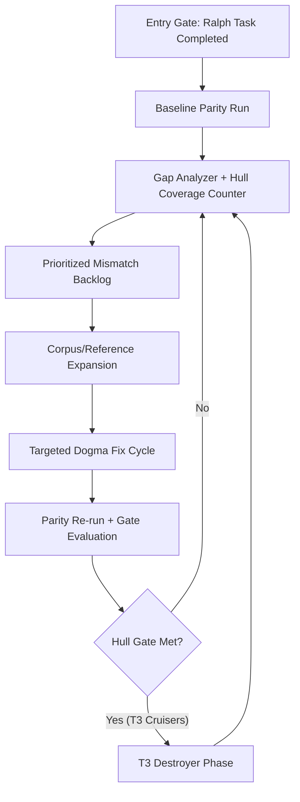
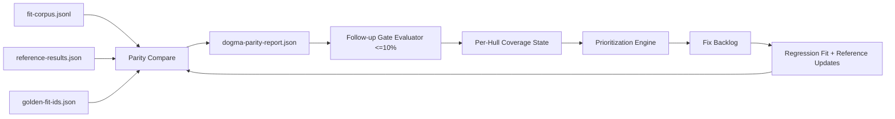
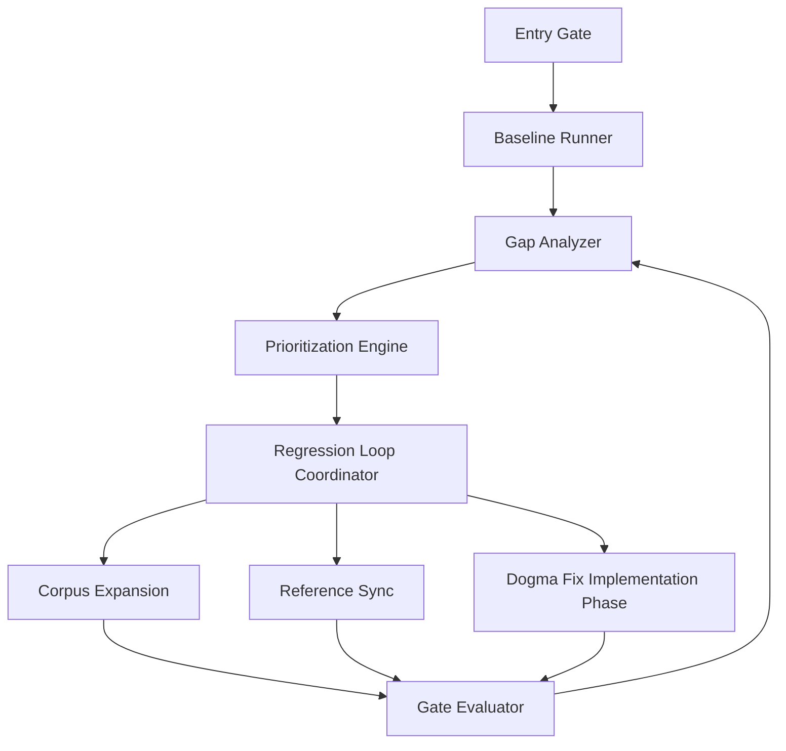

# Design: Ship Combat Capability Accuracy Follow-up

Date: 2026-02-18
Status: Draft for review

## Overview
This design defines the post-Ralph follow-up phase to improve Dogma combat capability parity against pyfa for currently surfaced metrics, prioritizing T3 cruisers first and then T3 destroyers.

The effort is constrained to planning and implementation guidance only. No runtime behavior changes are made in this design document.

Primary objective:
- Reduce parity error for currently surfaced metrics to within 10% per metric per fit, with exact-match preference where practical.

Completion objective:
- At least 10 parity-passing fits per specified hull, with sequencing:
1. T3 cruisers (Loki, Legion, Proteus, Tengu)
2. T3 destroyers (Hecate, Jackdaw, Confessor, Svipul)

Entry condition:
- Work begins only after the in-progress Ralph task is complete/merged.

Out of scope:
- Capacitor, application, and other non-surfaced metrics.
- Broad simulator rewrites not required by parity gaps.

## Detailed Requirements
### Functional Requirements
1. Entry gating
- The follow-up workflow must not begin execution until the current Ralph task is completed.

2. Baseline generation
- The workflow must generate a reproducible post-merge baseline from current parity artifacts.
- The baseline must include fit-level deltas, per-hull pass counts, and top mismatch rankings.

3. Parity pass rule
- A fit is passing only when every in-scope surfaced parity metric is within 10% of pyfa.
- Exact match remains preferred but not mandatory for pass status.

4. Coverage gate by hull
- For each prioritized hull, at least 10 distinct fits must pass parity.
- Distinct means deduplicated by canonical fit identity to avoid count inflation.

5. Phase sequencing
- T3 cruiser gate must be satisfied before T3 destroyer gate is treated as complete.

6. Corpus growth and curation
- The workflow must support iterative addition of new fits and pyfa references.
- Added fits must prioritize combinations that reveal known simulator gaps (subsystems, tank style, weapon profile diversity).

7. Gap prioritization
- Mismatch prioritization must be deterministic and based on explicit scoring inputs.
- The score must include at least error severity and hull gate pressure.

8. Regression safety
- Every fix cycle must add/update parity tests and associated fit/reference artifacts before behavior changes (TDD red/green/blue in implementation plan).

### Non-Functional Requirements
1. Reproducibility
- Running the same inputs should produce stable artifacts and deterministic ordering.

2. Diagnosability
- Failures (pyfa sync, missing corpus/reference, dogma compute errors) must be reported with actionable context.

3. Incrementality
- Each cycle should produce measurable progress without requiring full-system redesign.

4. Backward stability
- Existing non-target hull behavior should remain stable unless intentionally changed and documented.

### Constraints
- Use existing parity infrastructure where possible (`fit-corpus`, `reference-results`, `golden-fit-ids`, parity scripts/tests).
- Keep changes focused; avoid unrelated refactors.

## Architecture Overview
The follow-up is a control-loop architecture over existing parity components.



Design intent:
- Reuse current parity runner/reporting as the measurement backbone.
- Add explicit follow-up gate logic and hull coverage tracking.
- Drive fixes by clustered mechanics, not isolated fit hacks.

## Components and Interfaces
### 1. Entry Gate Component
Purpose:
- Enforce “start after current Ralph task completes.”

Inputs:
- Task completion signal (branch merge marker, release marker, or explicit run flag).

Outputs:
- Boolean allow/deny for follow-up workflow start.

### 2. Baseline Runner Component
Purpose:
- Produce initial post-merge parity state from canonical corpus/reference inputs.

Inputs:
- `data/parity/fit-corpus.jsonl`
- `data/parity/reference-results.json`
- `data/parity/golden-fit-ids.json`

Outputs:
- `reports/dogma-parity-report.json`
- Follow-up baseline rollup artifact (new): hull coverage + 10% gate status + ranked deltas.

### 3. Gap Analyzer Component
Purpose:
- Convert parity report into prioritized backlog items.

Inputs:
- Baseline parity report
- Hull gate status

Outputs:
- Deterministic mismatch list grouped by likely mechanic family.

### 4. Corpus Expansion Component
Purpose:
- Add candidate fits for target hulls and maintain diversity.

Inputs:
- Target hull IDs (phase-specific)
- zKill fetch pipeline output

Outputs:
- Updated fit corpus candidates
- Curated selected fit IDs for reference generation

### 5. Reference Sync Component
Purpose:
- Generate/import pyfa reference results for new scoped fits.

Inputs:
- Scoped fit IDs
- EFT payloads
- pyfa runtime configuration

Outputs:
- Updated `reference-results.json`
- Sync diagnostics (including failures)

### 6. Gate Evaluator Component
Purpose:
- Evaluate per-fit and per-hull gates using follow-up threshold policy.

Inputs:
- Parity comparisons
- Target hull list

Outputs:
- Fit pass/fail map
- Per-hull pass counts
- Remaining deficit per hull

### 7. Regression Loop Component
Purpose:
- Coordinate TDD cycle and validate fixes.

Inputs:
- Prioritized mismatch cluster

Outputs:
- New/updated parity tests and fit artifacts
- Updated gate progress report

## Data Models
### Existing Canonical Models (Reused)
1. Fit corpus entry
```ts
{
  fitId: string;
  shipTypeId: number;
  eft: string;
  origin: "zkill" | "manual" | "svcfitstat";
  tags: string[];
}
```

2. Parity metric result
```ts
{
  fitId: string;
  shipTypeId: number;
  source: "app" | "pyfa" | "svcfitstat";
  sdeVersion: string;
  dpsTotal: number;
  alpha: number;
  ehp: number;
  resists: {
    shield: { em: number; therm: number; kin: number; exp: number };
    armor: { em: number; therm: number; kin: number; exp: number };
    hull: { em: number; therm: number; kin: number; exp: number };
  };
  metadata?: Record<string, string | number | boolean | null>;
}
```

### New Follow-up Artifacts (Proposed)
1. Follow-up baseline summary
```ts
{
  generatedAt: string;
  phase: "t3-cruiser" | "t3-destroyer";
  thresholdPolicy: { mode: "followup-10pct"; relMax: 0.10 };
  comparedFits: number;
  failingFits: number;
  perHull: Array<{
    shipTypeId: number;
    shipName: string;
    passingFits: number;
    requiredFits: number; // always 10 for this phase
    deficit: number;
  }>;
  topMismatches: Array<{
    fitId: string;
    shipTypeId: number;
    metric: string;
    absDelta: number;
    relDelta: number;
  }>;
}
```

2. Prioritized backlog item
```ts
{
  id: string;
  fitIds: string[];
  shipTypeIds: number[];
  likelyMechanicFamily: string;
  score: number;
  scoreBreakdown: {
    errorSeverity: number;
    hullGatePressure: number;
    mechanicReuse: number;
    fitPrevalence: number;
  };
  status: "todo" | "in_progress" | "done";
}
```

## Data Flow


## Error Handling
### 1. Pyfa runtime/reference failures
- Capture per-fit failure reason, stage, timeout, stderr tail, EFT hash.
- Do not silently skip failed references in follow-up gate reports.
- Mark affected fits as blocked (not pass/fail) until reference is available.

### 2. Missing corpus/reference entries
- Distinguish `missing_corpus_entry` from `missing_reference_result`.
- Exclude blocked fits from pass counts while reporting explicit deficits.

### 3. Dogma compute failures
- Persist fit-level error diagnostics with stage details.
- Keep loop progressing on other fits while preserving failure visibility.

### 4. Threshold-policy mismatch
- Explicitly version threshold policy in follow-up artifacts to prevent ambiguity between existing sample/ci thresholds and follow-up 10% gate.

### 5. Sequence enforcement failures
- If T3 destroyer phase starts before cruiser gate completion, fail fast with actionable message.

## Acceptance Criteria
### AC1: Entry gating
- Given the current Ralph task is not completed
- When the follow-up workflow is started
- Then the run exits before baseline generation and reports entry-gate failure.

### AC2: Baseline artifact generation
- Given canonical parity inputs are present
- When baseline execution runs
- Then parity report and follow-up baseline summary are both generated with deterministic ordering.

### AC3: Fit-level pass rule
- Given a fit has all in-scope surfaced metrics within 10% of pyfa
- When follow-up gate evaluation runs
- Then the fit is marked passing.

### AC4: Fit-level failure rule
- Given a fit has any in-scope surfaced metric above 10% delta
- When follow-up gate evaluation runs
- Then the fit is marked failing and includes metric-level delta details.

### AC5: Cruiser phase completion gate
- Given T3 cruiser pass counts per hull are computed
- When each cruiser hull reaches at least 10 passing fits
- Then cruiser phase is marked complete.

### AC6: Destroyer phase sequencing
- Given cruiser phase is not complete
- When destroyer completion is evaluated
- Then destroyer phase cannot be marked complete.

### AC7: Prioritization determinism
- Given the same parity report and scoring inputs
- When prioritization runs twice
- Then backlog ordering is identical.

### AC8: Regression artifact requirement
- Given a combat capability bug is selected for fixing
- When the fix cycle starts
- Then a new/updated parity fit and reference artifact exist before Dogma behavior change is accepted.

### AC9: Completion gate
- Given all specified cruiser and destroyer hulls each have at least 10 passing fits
- When final gate evaluation runs
- Then the follow-up phase is marked complete.

## Testing Strategy
### Unit Tests
1. Follow-up threshold evaluator
- Validate strict `<=10%` evaluation for each metric.
- Validate edge cases near boundary values.

2. Hull coverage counter
- Validate per-hull pass counts and deficits.
- Validate blocked-fit handling for missing references.

3. Prioritization scoring
- Validate deterministic score/order given fixed inputs.

4. Sequence guard
- Validate cruiser-before-destroyer enforcement.

### Integration Tests
1. Baseline workflow integration
- Run parity -> follow-up rollup -> prioritization on fixture corpus.

2. Scoped new-fit workflow integration
- Add scoped fits, sync references, run compare, verify gate deltas.

3. Error-path integration
- Simulate pyfa failure and missing reference scenarios; verify diagnostics and non-silent behavior.

### Regression/Parity Tests
- For each bugfix cycle, add/update parity fit corpus entry plus pyfa reference before logic change (red).
- Verify targeted parity tests pass after minimal fix (green).
- Run full suite (`npm test`) and build (`npm run build`) at cycle completion (blue verification guard).

## Appendices
### A. Technology Choices
- Reuse existing parity scripts and schema to avoid introducing a second parity system.
- Reuse zKill fetch + normalization pipeline for corpus expansion.
- Reuse pyfa local adapter and diagnostics for reference generation.

### B. Research Findings Summary
As of 2026-02-18 repository state:
- Existing sample parity report is green on current corpus/golden set.
- T3 coverage is below target gate (10 per hull), especially for T3 destroyers.
- Subsystem effect coverage appears partial, with multiple subsystem effects present in corpus but not explicitly modeled in current rule sets.
- Historical runtime issues exist for reference generation in some environments; explicit readiness and diagnostics are required.

### C. Alternative Approaches Considered
1. Full dogma engine rewrite first
- Rejected for this phase due to high risk and slow feedback.

2. Broad random-fit expansion before targeted mechanics
- Rejected as primary strategy because it can dilute signal and slow convergence on high-impact gaps.

3. Keep existing sample/ci thresholds as sole completion gate
- Rejected for this phase because user target is explicit `<=10%` per surfaced metric and hull-specific pass-count goals.

### D. Component Relationship Diagram


## Source References
- `specs/improve-accuracy-of-ship-combat-capability/requirements.md`
- `specs/improve-accuracy-of-ship-combat-capability/research/01-baseline-gap-measurement.md`
- `specs/improve-accuracy-of-ship-combat-capability/research/02-t3-mechanics-audit.md`
- `specs/improve-accuracy-of-ship-combat-capability/research/03-parity-corpus-expansion.md`
- `specs/improve-accuracy-of-ship-combat-capability/research/04-prioritization-iteration-loop.md`
