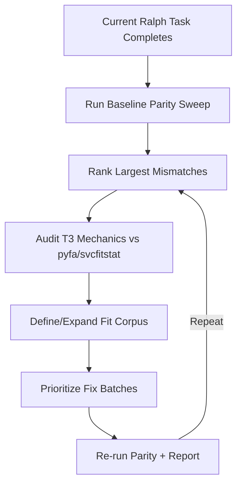

# Research Plan: Ship Combat Capability Parity Follow-up

## Objective
Define the highest-impact next gaps in Dogma combat capability accuracy after the in-progress Ralph task lands, with focus on T3 cruisers first and T3 destroyers second.

## Proposed Topics

### 1) Baseline and Gap Measurement Strategy
- Confirm current in-scope surfaced metrics and parity pass/fail rule (all in-scope metrics within 10% of pyfa).
- Define reproducible baseline workflow to run immediately after current task completion.
- Specify output artifacts for ranking worst mismatches.

### 2) T3 Cruiser/T3 Destroyer Mechanics Coverage Audit
- Map subsystem/role/skill interactions that most frequently cause parity drift.
- Cross-check current Dogma handling versus pyfa/svcfitstat reference behavior.
- Identify likely unsupported or partially supported mechanics.

### 3) Parity Corpus Expansion Strategy
- Define how to add at least 10 distinct fits per specified ship type.
- Ensure fit set spans subsystem permutations and common weapon/tank styles.
- Define reference generation and update workflow for pyfa parity data.

### 4) Prioritization and Iteration Loop
- Define how to prioritize fixes by impact (error magnitude x fit prevalence x mechanic centrality).
- Define iteration cadence for adding new combinations and re-running parity.

## Deliverables
- `research/01-baseline-gap-measurement.md`
- `research/02-t3-mechanics-audit.md`
- `research/03-parity-corpus-expansion.md`
- `research/04-prioritization-iteration-loop.md`

## Research Workflow Diagram

## Notes
This plan is a draft for user approval and may be adjusted before research execution.
