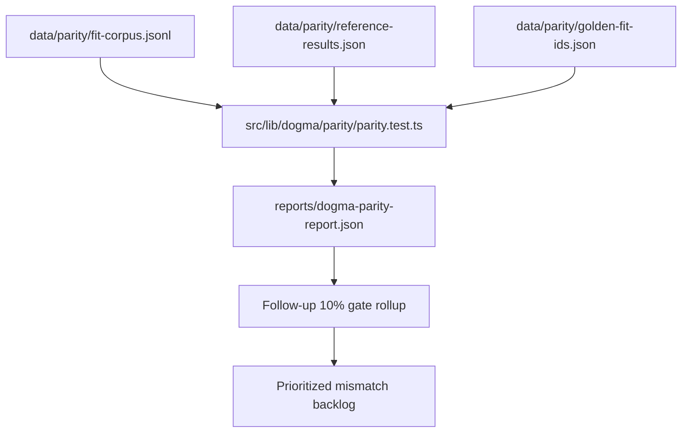

# Baseline and Gap Measurement

Date: 2026-02-18

## Research Question
How should we measure post-merge parity gaps in a repeatable way, and how does the current gate differ from the follow-up target (all surfaced metrics within 10% of pyfa, exact when possible)?

## Current Baseline (Repository Snapshot)
- Latest parity report shows `comparedFits=85`, `failingFits=0`, `goldenFits=85` in sample mode.
- The parity test writes a full JSON comparison report to `reports/dogma-parity-report.json`.
- `dogma:parity:sample` and `dogma:parity:ci` both execute the same parity test with different threshold sets.

## Existing Threshold Model vs Requested Gate
- Current sample thresholds: DPS/alpha `8% or 25 abs`, EHP `10% or 500 abs`, resist `0.05 abs`.
- Current CI thresholds: DPS/alpha `5% or 15 abs`, EHP `7% or 350 abs`, resist `0.03 abs`.
- Requested follow-up gate: every in-scope surfaced metric within 10% (exact preferred).

Inference from sources:
- Absolute floors (for example `abs=25` on low DPS fits) can be looser than 10% even when a fit still passes.
- If we want strict 10% semantics for this follow-up phase, we need an explicit metric gate report in addition to current sample/CI pass signals.

## Recommended Post-Merge Baseline Workflow
1. Freeze baseline inputs: `fit-corpus.jsonl`, `reference-results.json`, `golden-fit-ids.json`.
2. Run sample parity (`npm run dogma:parity:sample`) to produce full comparison report.
3. Run CI parity (`npm run dogma:parity:ci`) to check stricter current gate.
4. Produce a follow-up-specific rollup from report data:
- Per-fit max relative delta
- Per-ship-type pass/fail under `<=10%` gate
- Top N mismatches by absolute error and relative error
5. Store as a dated artifact (for example `reports/dogma-parity-followup-baseline.<date>.json`).

## Measurement Data Flow

## Operational Risks Found
- Pyfa reference generation depends on local Python runtime setup and pyfa dependencies.
- Historical reference sync reports include environment/runtime failures (for example Docker daemon unavailable in older direct-cli runs), so baseline execution should include a readiness check before parity runs.

## Sources
- `src/lib/dogma/parity/parity.test.ts:16`
- `src/lib/dogma/parity/parity.test.ts:76`
- `src/lib/dogma/parity/types.ts:50`
- `src/lib/dogma/parity/types.ts:57`
- `scripts/run-dogma-parity.mjs:4`
- `package.json:15`
- `package.json:16`
- `scripts/sync-parity-references.mjs:16`
- `tools/parity/pyfa-adapter/run-pyfa-local.mjs:7`
- `reports/dogma-parity-report.json`
- `reports/dogma-parity-reference-sync.json`
