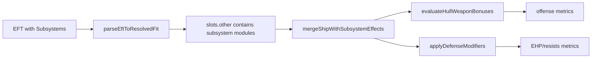

# T3 Mechanics Audit

Date: 2026-02-18

## Research Question
Which T3 mechanics are currently modeled in Dogma, and where are likely parity gaps for the next post-merge fix cycle?

## Current Implementation Shape
- EFT parser routes subsystem lines into `slots.other` and category-32 subsystem modules.
- Combat calculator merges subsystem effects into the effective ship effect set before offense/defense calculations.
- T3-specific weapon effects are primarily pattern-based regex rules in `hullBonuses.ts`.
- Some defensive parity behavior is hardcoded by ship type ID (for example Proteus and Loki HP uplift).

## Observed T3 Coverage in Current Parity Corpus
- T3 cruiser fits in corpus: 5 total.
- T3 destroyer fits in corpus: 2 total.
- Included T3 cruiser hulls: Loki, Legion, Proteus, Tengu.
- Included T3 destroyer hulls: Hecate only (no Jackdaw, Confessor, Svipul yet).

## Subsystem Effect Coverage Signals
From a scan of subsystem effects present in current T3 cruiser corpus fits:
- Explicitly matched by current T3 weapon rules:
- `subsystemBonusMinmatarOffensive2ProjectileWeaponDamageMultiplier`
- `subsystemBonusMinmatarOffensive2MissileLauncherROF`
- `subsystemBonusCaldariOffensive1LauncherROF`
- `subsystemBonusAmarrOffensiveMissileLauncherROF`
- Present but not explicitly handled (examples):
- `subsystemBonusCaldariOffensive2MissileLauncherKineticDamage`
- `subsystemBonusAmarrOffensive2MissileDamage`
- `subsystemBonusGallenteOffensiveDroneDamageHP`
- `subsystemBonusMinmatarOffensiveProjectileWeaponFalloff`
- `subsystemBonusMinmatarOffensiveProjectileWeaponMaxRange`
- `subsystemBonus...Defensive...RepairAmount`

Inference from sources:
- Current T3 handling appears strongest for select offensive ROF/damage multipliers, while several damage-type, drone, range/falloff, and repair-profile subsystem effects remain likely under-modeled.

## T3 Effect Path

## High-Impact Audit Targets
1. T3 cruiser offensive subsystems with missile damage-type bonuses and drone offensive bonuses.
2. T3 cruiser defensive subsystem repair/HP interactions beyond current hardcoded hull uplifts.
3. T3 propulsion/core subsystem effects that alter derived combat outputs indirectly (speed/sig/range consequences).
4. Tactical destroyer mode assumptions versus hull-specific behavior (all four T3D hulls, not only Hecate).

## Sources
- `src/lib/dogma/parity/eft.ts:91`
- `src/lib/dogma/parity/eft.ts:161`
- `src/lib/dogma/calc.ts:55`
- `src/lib/dogma/calc.ts:59`
- `src/lib/dogma/rules/hullBonuses.ts:30`
- `src/lib/dogma/rules/hullBonuses.ts:35`
- `src/lib/dogma/rules/hullBonuses.ts:36`
- `src/lib/dogma/rules/hullBonuses.ts:37`
- `src/lib/dogma/calc.ts:1013`
- `src/lib/dogma/calc.ts:1018`
- `src/lib/dogma/calc.ts:1208`
- `src/lib/dogma/rules/shipEffects.ts:128`
- `data/parity/fit-corpus.jsonl`
- `data/parity/golden-fit-ids.json`
