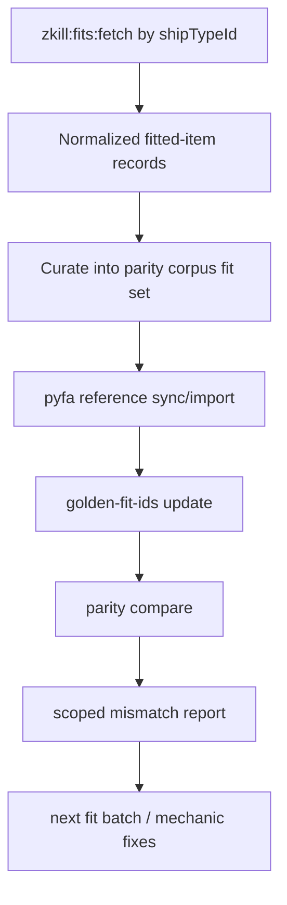

# Parity Corpus Expansion Strategy

Date: 2026-02-18

## Research Question
How do we expand parity coverage to meet the phase gate of at least 10 passing fits per specified ship type (T3 cruisers first, then T3 destroyers)?

## Current Count vs Target
Current corpus/golden snapshot:
- Loki: 2 fits (needs +8 to reach 10)
- Legion: 1 fit (needs +9)
- Proteus: 1 fit (needs +9)
- Tengu: 1 fit (needs +9)
- Hecate: 2 fits (needs +8)
- Jackdaw: 0 fits (needs +10)
- Confessor: 0 fits (needs +10)
- Svipul: 0 fits (needs +10)

Totals to meet gate:
- T3 cruisers: +35 additional fits
- T3 destroyers: +38 additional fits

## Existing Tooling Useful for Expansion
- Fetch pipeline accepts explicit ship type IDs and retrieves zKill + ESI hydrated fitted items.
- New-fit parity pipeline supports scoped fit IDs and writes scoped mismatch artifacts.
- Reference sync pipeline supports pyfa auto-reference generation and detailed failure records.

## Important Dependency
- The new-fit parity CLI still has a placeholder for Dogma runtime binding (`computeActualForFitFn` required until wired).

Inference from sources:
- If the current in-progress Ralph task is wiring this missing binding, post-merge follow-up can run scoped new-fit parity directly.
- If not wired yet, fallback is to continue via existing full parity flow plus manual scoped filtering.

## Proposed Expansion Workflow
1. Phase A (T3 cruisers only): fetch and curate fits for type IDs `29984,29986,29988,29990`.
2. Phase B (T3 destroyers): fetch and curate fits for type IDs `34317,34562,34828,35683`.
3. For each hull, build a 10-fit minimum matrix across:
- Primary weapon family variants
- Shield/armor tank variants
- Distinct subsystem combinations (cruisers)
4. Generate/update pyfa references for newly selected fits.
5. Add selected fit IDs to golden enforcement set.
6. Run parity and keep only combinations with all surfaced metrics within 10%.

## Coverage-Build Data Flow

## Scope Quality Rules for New Fits
- Enforce hull diversity and subsystem diversity before adding volume.
- Reject near-duplicate fits using canonical fit hash or equivalent dedupe criteria.
- Prefer fit sets that expose known weak mechanics (subsystem offensive/defensive variants).

## Sources
- `data/parity/fit-corpus.jsonl`
- `data/parity/golden-fit-ids.json`
- `scripts/lib/zkill-fit-fetch-cli/args.mjs:16`
- `scripts/lib/zkill-fit-fetch-cli/args.mjs:58`
- `scripts/lib/zkill-fit-fetch-cli/pipeline.mjs:7`
- `scripts/lib/zkill-fit-fetch-cli/pipeline.mjs:8`
- `scripts/lib/dogma-parity-new-fits/cli.mjs:226`
- `scripts/lib/dogma-parity-new-fits/cli.mjs:323`
- `scripts/sync-parity-references.mjs:41`
- `package.json:23`
- `package.json:30`
