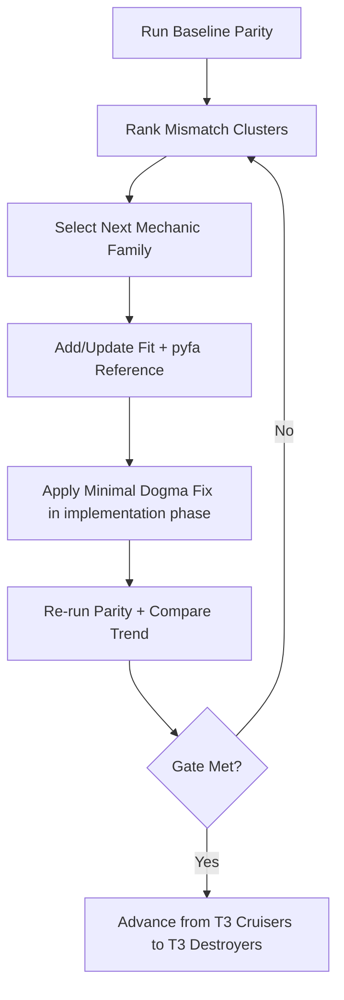

# Prioritization and Iteration Loop

Date: 2026-02-18

## Research Question
What prioritization loop should drive post-merge parity improvements so we converge quickly on T3 cruiser/T3 destroyer accuracy gates?

## Prioritization Model
Use a deterministic score per mismatch:

`priority = error_severity * hull_gate_pressure * mechanic_reuse * fit_prevalence`

Where:
- `error_severity`: max(relative delta across surfaced metrics)
- `hull_gate_pressure`: boosts hulls farthest from 10 passing fits
- `mechanic_reuse`: boosts effects appearing across many fits (for example shared subsystem effect families)
- `fit_prevalence`: boosts common combat archetypes likely to matter to users

## Iteration Cadence
1. Baseline run and mismatch extraction.
2. Pick highest-priority mismatch cluster (not one isolated fit).
3. Add/update regression fit(s) and pyfa references for that cluster.
4. Implement minimal Dogma fix in next implementation phase.
5. Re-run parity and record delta reduction.
6. Repeat until per-hull pass-count gates are met.

## Suggested Tracking Metrics per Cycle
- Total compared fits
- Total failing fits under follow-up `<=10%` gate
- Per-hull passing count for T3 cruisers and T3 destroyers
- Top 10 mismatches (metric + abs + rel)
- Number of unresolved pyfa/reference failures

## Iteration Loop

## Exit Gates for This Follow-up Plan
- T3 cruisers first: each hull reaches at least 10 fits passing parity (`<=10%` on all surfaced metrics).
- Then T3 destroyers: each hull reaches at least 10 fits passing parity.
- Keep exact-match preference as optimization target once the 10% gate is stable.

## Risks to Manage in the Loop
- False confidence from broad thresholds with absolute floors.
- Environment instability in pyfa reference generation causing non-code failures.
- Overfitting to single-hull hardcoded corrections instead of effect-family fixes.

## Sources
- `src/lib/dogma/parity/types.ts:50`
- `src/lib/dogma/parity/types.ts:57`
- `src/lib/dogma/calc.ts:62`
- `src/lib/dogma/calc.ts:330`
- `src/lib/dogma/calc.ts:1013`
- `src/lib/dogma/calc.ts:1208`
- `src/lib/dogma/rules/hullBonuses.ts:19`
- `reports/dogma-parity-report.json`
- `reports/dogma-parity-coverage-gap-report.json`
- `reports/dogma-bonus-audit.json`
