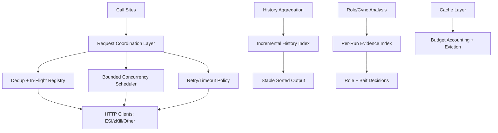
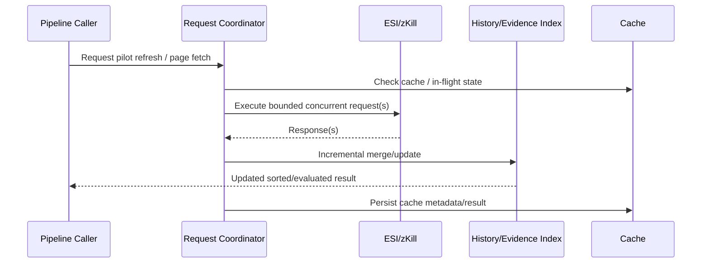
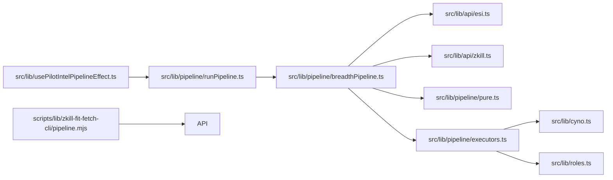

# Design: Performance Refactor for Node/TypeScript Codebase

## Overview
This design defines a performance-focused refactor of the Node/TypeScript codebase to remove latent scaling risks and HTTP inefficiencies while keeping user-visible behavior broadly stable.

Scope:
- In scope: all Node/TypeScript code.
- Out of scope: `pyfa/` and `svcfitstat/`.

Primary objective:
- Produce a prioritized, implementation-ready refactor proposal that addresses Big O risks and HTTP inefficiency patterns (duplicate requests, N+1, serializable calls, missing batching, timeout/retry gaps, over-fetching, and connection reuse opportunities), ranked by estimated impact.

Constraint summary:
- Ranking is by estimated impact, not category.
- Impact estimation uses Big O reasoning and optional unit-test timing signals for non-HTTP paths.
- API/behavior changes are allowed when justified, but overall application behavior should remain functionally equivalent.
- Better public APIs can be adopted where available.
- Recommendations may include new tools/libraries if materially beneficial.

## Detailed Requirements
1. Analyze the full Node/TypeScript codebase (excluding `pyfa/` and `svcfitstat/`) for performance risks.
2. Include all HTTP inefficiency classes:
   - duplicate requests
   - N+1 patterns
   - sequential calls that can be parallelized
   - missing batching/windowing
   - missing timeout/retry/backoff behavior
   - over-fetching
   - connection reuse opportunities
3. Provide a full change proposal (not just findings) with:
   - concrete refactor tasks
   - estimated impact per finding
   - acceptance tests per finding
4. Prioritize all findings by estimated impact.
5. Use Big O reasoning as primary justification; use existing unit-test runtime observations only where applicable.
6. For HTTP inefficiencies, do not depend on runtime timing assertions for validity.
7. Preserve broad application behavior unless a justified API/behavior change is explicitly part of a finding.
8. Prefer current stack when reasonable, but allow introducing dependencies when they provide clear value.

## Architecture Overview
### Proposed Refactor Architecture

### Runtime Data Flow (Target)

### Component Relationship

## Components and Interfaces
### 1. HTTP Request Coordination (Primary)
Target modules:
- `src/lib/api/esi.ts`
- `src/lib/api/zkill.ts`
- `src/lib/usePilotIntelPipelineEffect.ts`
- `scripts/lib/zkill-fit-fetch-cli/pipeline.mjs`

Design changes:
1. Cache presence semantics must be explicit (`value !== null`) instead of truthy checks for sentinel values such as `0`.
2. Background refresh in `usePilotIntelPipelineEffect` should use bounded concurrency instead of serial per-pilot execution.
3. Fit-fetch CLI ESI hydration should process candidates with bounded parallelism and controlled failure collection.
4. zKill in-flight dedupe should avoid duplicate fg/bg requests for equivalent keys when safe.
5. Optional: introduce a shared lightweight concurrency helper reused across runtime and scripts.

Interface shape (conceptual):
- `runWithConcurrency<T, R>(items: T[], concurrency: number, task: (item: T) => Promise<R>): Promise<R[]>`
- `hasCachedValue<T>(lookup: { value: T | null }): boolean`

### 2. Incremental History Aggregation
Target modules:
- `src/lib/pipeline/breadthPipeline.ts`
- `src/lib/pipeline/pure.ts`

Design changes:
1. Avoid full re-merge/re-sort on every incremental page update.
2. Maintain incremental ordering state (or precomputed timestamp map) to avoid repeated `Date.parse` during sort comparator execution.
3. Emit sorted rows from incremental state updates.

Interface shape (conceptual):
- `updateHistoryIndex(index, newRows): { added: number, sortedRows: ZkillKillmail[] }`
- `toEpochMs(killmail): number` (computed once per row)

### 3. Evidence Indexing for Role/Cyno Paths
Target modules:
- `src/lib/cyno.ts`
- `src/lib/roles.ts`

Design changes:
1. Build per-run indexes keyed by ship and module characteristics once.
2. Replace repeated `losses.filter(...).flatMap(...)` per ship with indexed lookups.
3. Replace O(E^2) evidence dedupe with Set-key dedupe.

Interface shape (conceptual):
- `buildLossEvidenceIndex(losses, characterId, namesByTypeId)`
- `dedupeEvidence(evidence): RolePillEvidence[]`

### 4. Cache Budget Accounting Efficiency
Target module:
- `src/lib/cache/localStore.ts`

Design changes:
1. Reduce repeated full localStorage scans on burst writes.
2. Use amortized accounting strategy (cached usage + periodic recompute) or batch-write context with single usage scan.

## Data Models
### Request/Cache Semantics
- Cached lookup semantics:
  - `value: null` means cache miss.
  - Any non-null value (including `0`) means cache hit.

### History Index Model
- `HistoryIndex`
  - `byId: Map<number, RowWithEpoch>`
  - `sortedIds: number[]` (or sorted rows)
  - `epochById: Map<number, number>`

### Evidence Index Model
- `LossEvidenceIndex`
  - `byShipName: Map<string, ShipLossEvidence>`
  - `globalSignals: { hasAnyCyno: boolean; ... }`

### Finding/Proposal Model (for execution planning)
- `PerformanceFinding`
  - `id`, `title`, `module`, `category`, `impactRank`, `complexityShape`, `risk`, `proposal`, `acceptanceTests`

No persisted external schema/version changes are required for this refactor design.

## Error Handling
1. Preserve existing abort semantics (`AbortError`) and do not mask caller cancellations.
2. For bounded concurrency tasks, aggregate non-fatal failures where current behavior is best-effort, and fail-fast where current behavior is strict.
3. Maintain retry/backoff behavior compatibility unless explicitly improved.
4. On cache/index corruption or malformed rows, retain current defensive fallback behavior (skip invalid rows; continue processing).
5. For optional API upgrades, include explicit fallback behavior when unavailable.

## Acceptance Criteria (Given-When-Then)
### AC-1 Inventory Type Miss Cache Correctness
Given inventory-type cache contains key `eve-intel.cache.inventory-type.<name>` with value `0`
When `resolveInventoryTypeIdByName(<name>)` is invoked repeatedly before TTL expiry
Then it does not issue duplicate ESI requests for that miss and returns `undefined`.

### AC-2 Background Refresh Concurrency
Given a roster with multiple pilots eligible for background refresh
When `runBackgroundRefreshSweep` executes
Then requests are scheduled with bounded concurrency (not strictly serial), and no pilot is processed concurrently more than once.

### AC-3 Fit-Fetch CLI Hydration Parallelism
Given `N` zKill candidates requiring ESI hydration
When fit-fetch CLI pipeline runs
Then ESI hydration executes with configured bounded parallelism and preserves deterministic output ordering.

### AC-4 zKill In-Flight Deduplication
Given simultaneous equivalent zKill list requests from foreground/background paths
When dedupe keying is applied
Then only one network request is issued for equivalent work, and both callers receive the same resolved data.

### AC-5 Incremental History Update Efficiency
Given existing history state and a newly fetched page
When history updates are applied
Then only delta rows are integrated and output ordering remains correct without full-list reparse/sort on every update.

### AC-6 Comparator Parse Elimination
Given merged history sorting logic
When ordering is computed
Then timestamps are not repeatedly parsed inside sort comparator paths.

### AC-7 Role/Cyno Index-Based Evaluation
Given predicted ships and losses for a pilot
When role pills and bait/cyno signals are computed
Then results match previous behavior while using indexed lookups instead of repeated full rescans.

### AC-8 Cache Budget Accounting Scalability
Given burst cache writes in a single operation window
When local cache budget checks execute
Then localStorage usage scans are amortized (not repeated full scans per individual write).

### AC-9 Regression Safety
Given the full existing test suite
When refactor tasks are completed
Then `npm test` and `npm run build` pass with no behavioral regressions in covered paths.

## Testing Strategy
Follow repository-mandated red-green-blue workflow for each finding.

Per finding workflow:
1. Red gate:
   - Add/adjust focused tests that fail for the target inefficiency or regression risk.
   - Prefer module-level tests closest to modified code (`src/lib/api/*.test.ts`, pipeline tests, script tests).
2. Green gate:
   - Implement minimal code change to satisfy tests.
   - Run targeted tests for touched modules.
3. Blue gate:
   - Refactor/cleanup while preserving green tests.
   - Re-run targeted tests.

Validation order (mandatory):
1. Targeted tests for touched area.
2. Full suite: `npm test`.
3. Build verification: `npm run build`.
4. Update `CHANGELOG.md` with concise version-scoped summary derived from git history.

Suggested test coverage additions:
- `src/lib/api/esi.test.ts`: sentinel miss cache (`0`) behavior.
- `src/lib/usePilotIntelPipelineEffect.test.tsx`: background refresh scheduling/concurrency.
- `scripts/tests/fetch-zkill-fits*.test.mjs`: bounded hydration concurrency + error aggregation.
- `src/lib/pipeline/breadthPipeline.test.ts`: incremental history updates and ordering invariants.
- `src/lib/roles.test.ts`, `src/lib/cyno.test.ts`: indexed logic parity tests.
- `src/lib/cache/*` tests: amortized budget-accounting behavior.

## Appendices
### A. Technology Choices
- Default: stay within existing stack (TypeScript/Node + existing helpers).
- Optional recommendations if needed:
  - lightweight concurrency utility (`p-limit`) only if existing local helper reuse is insufficient.
- Prefer first-party/shared helper consolidation over adding heavy dependencies.

### B. Research Findings Summary
See:
- `specs/refactor-codebase-for-performance/research/01-scope-and-flows.md`
- `specs/refactor-codebase-for-performance/research/02-http-inefficiency-findings.md`
- `specs/refactor-codebase-for-performance/research/03-big-o-findings.md`
- `specs/refactor-codebase-for-performance/research/04-synthesis-prioritized-findings.md`

Top priorities from research:
1. Fix cache sentinel falsey check in inventory type resolution.
2. Replace serial per-pilot background refresh with bounded concurrency.
3. Replace serial CLI ESI hydration with bounded concurrency.
4. Eliminate repeated full-history sort/reparse patterns.

### C. Alternative Approaches
1. Conservative-only approach:
   - Limit changes to bug-level fixes (cache sentinel + minor dedupe).
   - Lower risk, lower performance upside.
2. Aggressive architecture extraction:
   - Introduce centralized request-orchestration framework used everywhere.
   - Higher upfront complexity, stronger long-term consistency.
3. Hybrid (recommended):
   - Deliver high-impact targeted fixes first, then selectively consolidate shared scheduling/dedupe primitives.

### D. Limitations
- Current impact ranking is based on static analysis + complexity reasoning, not production telemetry.
- HTTP optimization decisions may require environment-specific tuning if runtime/host characteristics differ.
