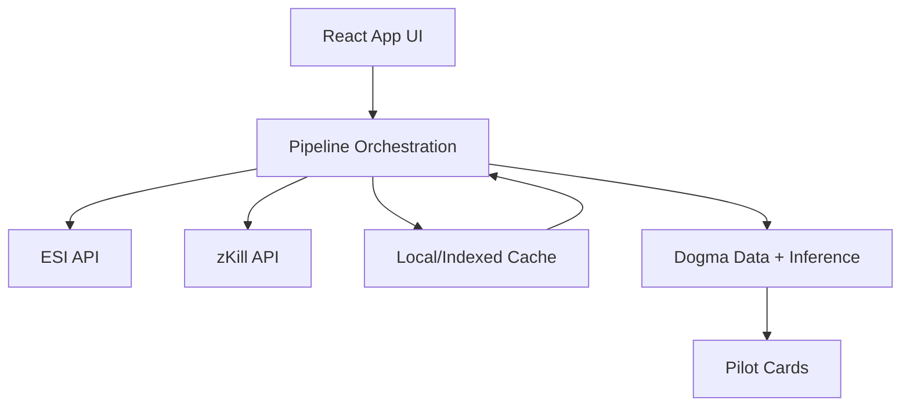
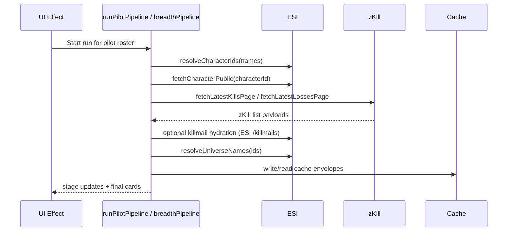
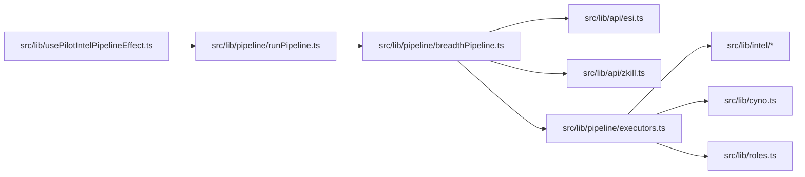

# Research: Scope and Runtime Flows

## Scope
- Included: Node/TypeScript code under `src/`, `scripts/`, `tools/`, `electron/`.
- Excluded: `pyfa/`, `svcfitstat/`.
- Focus areas:
  - Big O-driven complexity risks.
  - HTTP inefficiencies: duplicate requests, N+1, serializable request chains, missing batching, timeout/retry gaps, over-fetching, connection reuse controls.

## Method
- Static code inspection (no implementation changes, no benchmark/script execution).
- Prioritized runtime paths first: `src/lib/api/*`, `src/lib/pipeline/*`, `src/lib/intel/*`, `src/lib/cyno.ts`, `src/lib/roles.ts`, plus CLI/network scripts.
- Ranked impact by: likely call frequency x asymptotic growth x remote-call latency exposure.

## Architecture Overview

## HTTP Data Flow (Primary Runtime)

## Component Relationship (Hot Paths)

## HTTP Call-Site Inventory (key)
- Shared HTTP client with retry/timeout:
  - `src/lib/api/http.ts`
  - Used by `src/lib/api/esi.ts`, `src/lib/api/zkill.ts`.
- Direct `fetch` without shared retry wrapper (selected):
  - `src/lib/dogma/loader.ts`
  - `scripts/sync-sde.mjs`
  - `scripts/backtest-zkill.mjs`
  - `scripts/build-dogma-fit-corpus.mjs`
- Dedicated retry wrapper exists in CLI path:
  - `scripts/lib/zkill-fit-fetch-cli/retry.mjs`
  - `scripts/lib/zkill-fit-fetch-cli/pipeline.mjs`
