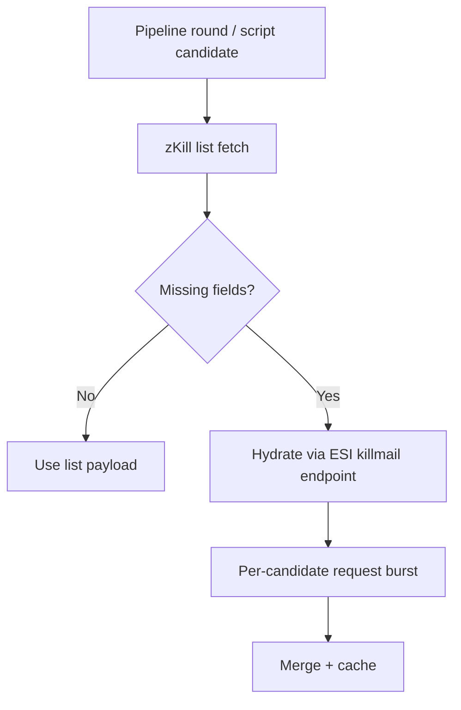

# Research: HTTP Inefficiency Findings

## Ranked Findings (Impact-First)

| Rank | Finding | Evidence | Shape | Estimated Impact |
|---|---|---|---|---|
| 1 | Inventory type miss-cache is effectively bypassed for `0` | `src/lib/api/esi.ts:178` checks `if (cached.value)` while misses are stored as `0` at `src/lib/api/esi.ts:328` | Intended O(1) cache hit degrades to repeated remote lookup | High (duplicate ESI lookups for unknown explicit ships; avoidable latency/rate-limit pressure) |
| 2 | Background refresh runs per pilot serially | `src/lib/usePilotIntelPipelineEffect.ts:285` loop; each iteration awaits page-1 kills/losses (`src/lib/usePilotIntelPipelineEffect.ts:319`) | O(P * RTT) wall-time per sweep | High for larger rosters (stale UI and slow convergence) |
| 3 | Fit-fetch CLI hydrates ESI killmails serially (N+1) | `scripts/lib/zkill-fit-fetch-cli/pipeline.mjs:64` candidate loop with awaited `fetchEsiKillmail` | O(N * RTT) | High for corpus generation/backfills |
| 4 | zKill summary normalization can fan out many ESI detail requests | Hydration trigger: `src/lib/api/zkill.ts:446`; limit `MAX_HYDRATE=50` at `src/lib/api/zkill.ts:11`; call path `src/lib/api/zkill.ts:451` | N+1 style request fan-out | Medium-High (remote latency and quota usage spikes) |
| 5 | In-flight dedupe key splits foreground/background and can duplicate same fetch | `src/lib/api/zkill.ts:296` uses `${cacheKey}|${signal ? "fg" : "bg"}` | Duplicate request window | Medium |
| 6 | Universe-name lookups are chunked but sequential; no in-flight dedupe map | Sequential batches at `src/lib/api/esi.ts:144`; contrast with in-flight maps at `src/lib/api/esi.ts:14` | O(B * RTT) with avoidable overlap under concurrency | Medium |
| 7 | Several fetch call sites bypass shared retry/timeout helper | `src/lib/dogma/loader.ts:26`, `scripts/sync-sde.mjs:31`, `scripts/backtest-zkill.mjs:83`, `scripts/build-dogma-fit-corpus.mjs:102` | Reliability gaps increase tail latency/failure retries at callers | Medium |
| 8 | SDE sync downloads required files serially | `scripts/sync-sde.mjs:28` loop + awaited fetch per file | O(F * RTT) instead of bounded concurrency | Medium |

## Coverage Against Requested HTTP Categories
- Duplicate requests:
  - Rank 1, Rank 5, Rank 6
- N+1 request patterns:
  - Rank 3, Rank 4
- Sequential calls that could be parallelized:
  - Rank 2, Rank 3, Rank 6, Rank 8
- Missing batching/windowing:
  - Rank 2 (per-pilot sweep scheduling), Rank 3 (candidate hydration windowing)
- Missing timeouts/retries:
  - Rank 7
- Over-fetching payloads:
  - Rank 4
- Connection reuse controls:
  - Heavy CLI paths rely on default global fetch behavior; no explicit agent/pool tuning observed (optimization opportunity, lower priority).

## Request Fan-Out Diagram

## Notes
- This is static analysis; no live benchmark numbers were captured in this research phase.
- Impact estimates are based on call patterns, asymptotic growth, and remote-call latency exposure.
