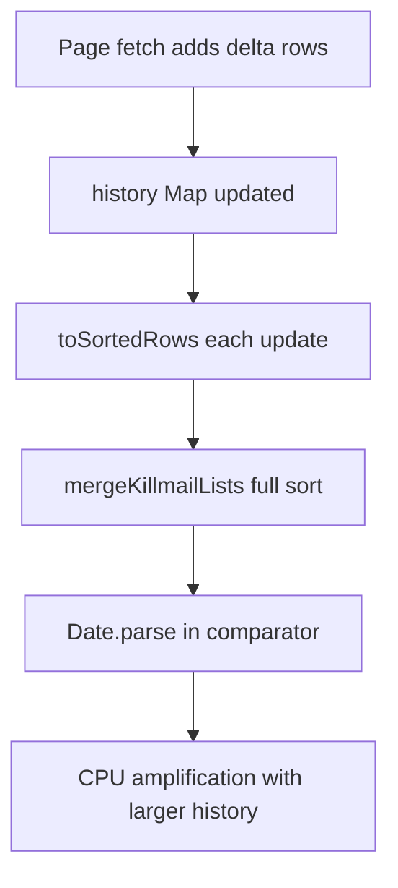

# Research: Big O and Computational Hotspots

## Ranked Findings (Impact-First)

| Rank | Finding | Evidence | Complexity Shape | Estimated Impact |
|---|---|---|---|---|
| 1 | Repeated full merge+sort of killmail history on incremental updates | `src/lib/pipeline/breadthPipeline.ts:625`, `src/lib/pipeline/breadthPipeline.ts:626` call `toSortedRows`; `src/lib/pipeline/breadthPipeline.ts:493` routes to `mergeKillmailLists`; `src/lib/pipeline/pure.ts:20` sorts entire list each call | Per update O(N log N), repeated across rounds -> roughly O(R * N log N) | High for long histories / many pilots |
| 2 | Sort comparator reparses timestamps repeatedly | `src/lib/pipeline/pure.ts:20` performs `Date.parse(...)` in comparator | Comparator-level parse amplification during O(N log N) sort | Medium-High CPU overhead on history-heavy runs |
| 3 | Bait scoring rescans all losses/items per predicted ship | `src/lib/cyno.ts:241`, `src/lib/cyno.ts:243`, `src/lib/cyno.ts:248` | O(P * L * I) | Medium |
| 4 | Role evidence extraction rescans losses per ship + O(E^2) dedupe | Loss scan per ship at `src/lib/roles.ts:228`; dedupe via `filter(...findIndex...)` at `src/lib/roles.ts:182` | O(P * L * I) + O(E^2) | Medium |
| 5 | Cache budget checks rescan localStorage per write (can become quadratic in batch writes) | `src/lib/cache/localStore.ts:53` calls `guardLocalStorageBudget`; `src/lib/cache/localStore.ts:82` calls `estimateLocalUsage`; `src/lib/cache/localStore.ts:92` scans all cache keys each write | O(K) per write, so O(W*K); with growing K this trends toward O(W^2) | Medium (name-cache write bursts) |
| 6 | Universe name chunk processing is serial across batches | `src/lib/api/esi.ts:144` loops batches and awaits each | O(B * RTT) end-to-end latency | Medium (large ID sets) |

## Complexity Relationship Diagram

## Notes
- Most hotspots are not algorithmic correctness bugs; they are scaling risks where growth in pilot count/history length increases cost non-linearly.
- A small number of index/precompute strategies would flatten these paths substantially (incremental ordering, timestamp precomputation, per-run indexing, Set-based dedupe keys).
