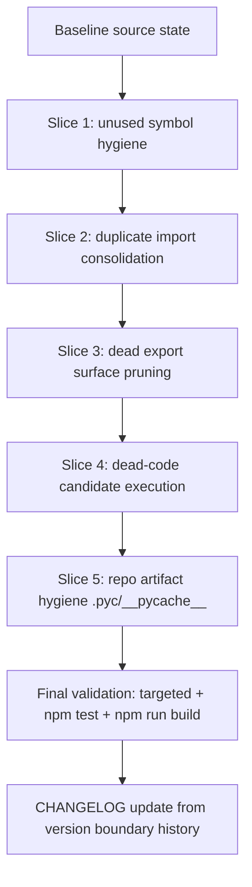
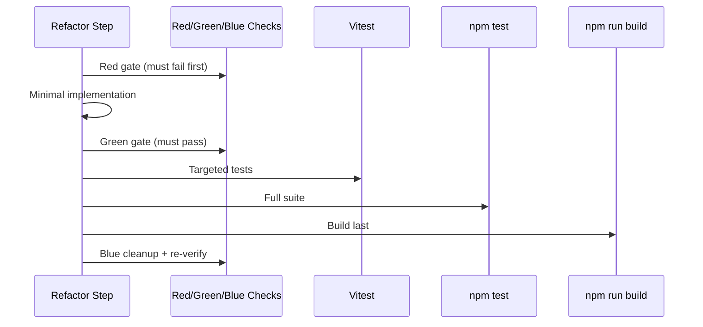

# Design: Refactor Node.js TypeScript Codebase (Readability + Dead Code Removal)

Date: 2026-02-18
Status: Draft for review

## Overview

This design defines a behavior-preserving refactor of the existing Node.js + TypeScript codebase (React app + Vitest + Node `.mjs` scripts) focused on:

1. readability improvements,
2. dead code removal/de-export,
3. repository hygiene cleanup.

The scope is limited to the findings and candidates already listed in `rough-idea.md`, with explicit exclusions for `./pyfa/**` and `./svcfitstat/**`.

Non-goal: introducing feature behavior changes.

## Detailed Requirements

### Functional and Behavioral Constraints

1. Runtime/application functionality must not change.
2. Any change that cannot be proven safe by tests/static checks must be deferred and documented as a blocker.
3. Scope is limited to listed findings and listed candidate dead-code items; no broad repo-wide opportunistic refactor.
4. Dead export removal is allowed (user confirmed no external consumers).

### Process Constraints

1. Follow AGENTS workflow with explicit Red-Green-Blue gates per planned change.
2. Apply TDD pattern for each behavior-affecting refactor slice:
   - Red: failing check/test proving current gap.
   - Green: minimal fix.
   - Blue: cleanup with green tests.
3. Validation order per AGENTS:
   - targeted tests,
   - `npm test`,
   - `npm run build` last.
4. Update `CHANGELOG.md` using git history between version markers/tags.

### Execution Scope

Included work items:

1. Remove unused imports/types/unused helper generic declarations in listed files.
2. Consolidate duplicate imports from the same module in listed files.
3. Remove/de-export confirmed unreferenced exports.
4. Execute dead-code-candidate verification/removal tasks listed in rough idea section 4.
5. Remove tracked `.pyc` artifacts and enforce ignore rule.

Excluded work items:

1. Any changes under `pyfa/**` and `svcfitstat/**`.
2. Feature additions or behavior redesign.

## Architecture Overview

The refactor is organized as four independent change slices plus a candidate-verification slice, each with its own Red-Green-Blue gate and rollback isolation.



## Components and Interfaces

### Component 1: Static Hygiene Gates

Purpose: provide deterministic Red gates for readability/dead-code targets without adding heavy external dependencies.

Interface expectations:

1. TypeScript strict-unused gate command:
   - `npx tsc -p tsconfig.json --noEmit --noUnusedLocals --noUnusedParameters`
2. Vitest-backed static checks under `scripts/tests/` for:
   - duplicate imports per file,
   - tracked binary/cache artifact detection,
   - export-usage allowlist/denylist assertions for targeted symbols.

### Component 2: Source Refactor Slices

Purpose: minimal, behavior-preserving code edits to satisfy each Red gate.

Target files (from confirmed findings/candidates):

1. `src/App.paste.integration.test.tsx`
2. `src/lib/pipeline/breadthPipeline.ts`
3. `src/lib/pipeline/derivedInference.test.ts`
4. `src/lib/usePilotIntelPipelineEffect.ts`
5. `src/lib/pipeline/executors.ts`
6. `src/lib/pipeline/derivedInference.ts`
7. `src/lib/pipeline/inferenceWindow.ts`
8. `src/lib/pipeline/snapshotCache.ts`
9. `src/lib/dogma/loader.ts`
10. `src/lib/dogma/index.ts`
11. `src/lib/dev/zkillRateLimitProbe.ts`
12. `scripts/zkill-rate-limit-probe.mjs`
13. `src/lib/backtest.ts`
14. `scripts/backtest-zkill.mjs`
15. `src/lib/dogma/engine/types.ts`
16. `.gitignore`
17. tracked `scripts/__pycache__/*.pyc`

### Component 3: Validation Pipeline

Purpose: preserve behavior while permitting non-functional cleanup.

Interface expectations:

1. Run targeted tests aligned to touched slice.
2. Run full test suite via `npm test`.
3. Run full build via `npm run build` last.
4. Fail fast with explicit blocker notes if any candidate cannot be proven safe.

## Data Models

No production runtime data model changes are required.

Refactor-only artifacts/data:

1. `requirements.md` Q&A and checkpoints.
2. Research topic markdown files under `research/`.
3. Static hygiene test inputs:
   - source file text,
   - import statement module specifiers,
   - symbol occurrence counts,
   - `git ls-files` output lines.

Validation results model (logical):

```text
GateResult {
  item: string,
  red: "pass" | "fail",
  green: "pass" | "fail",
  blue: "pass" | "fail",
  blockers: string[]
}
```

## Error Handling

1. If Red gate does not fail as expected, stop and adjust gate so it proves the intended issue.
2. If Green changes cause behavioral/test regression, rollback only that slice and re-approach minimally.
3. If dead-code candidate safety is ambiguous, do not force deletion; mark as blocker with evidence.
4. If build fails after tests pass, fix and rerun validation in AGENTS order with build last.
5. If changelog boundary tags are missing, use nearest version-marker commits and note assumption in changelog entry.

## Acceptance Criteria (Given-When-Then)

1. Given listed unused imports/types/params,
   When strict TypeScript unused checks run before fixes,
   Then they fail for the expected files/symbols.

2. Given minimal symbol cleanup is implemented,
   When targeted tests and static gates run,
   Then all item-1 gates pass with no behavior regressions.

3. Given duplicate import Red gate is added,
   When run on current baseline,
   Then it fails for the four confirmed files.

4. Given duplicate imports are consolidated,
   When duplicate-import gate and related tests run,
   Then they pass without functional differences.

5. Given dead export and candidate-verification gates,
   When executed against known unreferenced symbols,
   Then they fail pre-change and pass post de-export/removal for verified-safe symbols.

6. Given tracked `.pyc` artifacts currently exist,
   When repository hygiene gate runs pre-change,
   Then it fails; and post-cleanup it passes with ignore rule enforced.

7. Given all slices are complete,
   When `npm test` and then `npm run build` are executed,
   Then both succeed with build run last.

8. Given release notes policy,
   When refactor is complete,
   Then `CHANGELOG.md` is updated using git history between the relevant version boundaries.

## Testing Strategy

### Red-Green-Blue per Slice

1. Slice 1 (unused symbols)
   - Red: strict TypeScript unused command fails.
   - Green: remove/rename only unused symbols in listed files.
   - Blue: small readability normalization in touched import blocks.

2. Slice 2 (duplicate imports)
   - Red: static duplicate-import Vitest check fails.
   - Green: consolidate duplicate import declarations.
   - Blue: preserve explicit type/value grouping style.

3. Slice 3 (dead exports)
   - Red: export-usage check fails for known unreferenced exports.
   - Green: de-export/remove those symbols.
   - Blue: internal helper naming cleanup.

4. Slice 4 (dead-code candidates)
   - Red: characterization tests/graph checks demonstrate duplication or no usage.
   - Green: canonicalize/remove only proven-safe paths.
   - Blue: remove residual duplication/comments and keep module boundaries clear.

5. Slice 5 (artifact hygiene)
   - Red: tracked artifact check fails on `__pycache__`/`*.pyc`.
   - Green: delete tracked artifacts + ignore rule.
   - Blue: keep ignore list minimal/precise.

### Validation Sequence



## Appendices

### Appendix A: Technology Choices

1. Keep existing stack only: TypeScript compiler, Vitest, npm scripts.
2. Prefer in-repo static checks in `scripts/tests` over introducing new external tooling.

### Appendix B: Consolidated Research Findings

Source research files:

1. `specs/refactor-nodejs-typescript-codebase/research/01-findings-verification.md`
2. `specs/refactor-nodejs-typescript-codebase/research/02-dead-code-candidate-verification.md`
3. `specs/refactor-nodejs-typescript-codebase/research/03-validation-gates-and-workflow.md`

Highlights:

1. All 8 listed findings are confirmed with line-level evidence.
2. Probe/backtest logic is duplicated across script + TS module and should be canonicalized.
3. `EngineContext`, `OffenseStageInput`, and `DefenseStageInput` are currently unreferenced.
4. `getDogmaVersion`, `getAttr`, and `buildPilotSnapshotKey` are unreferenced outside their defining files.

### Appendix C: Alternative Approaches Considered

1. Add external dead-code tools (`ts-prune`) for export discovery.
   - Rejected for now: adds dependency/tooling drift risk; current scope can be covered by targeted in-repo checks.

2. Broad repo-wide refactor sweep.
   - Rejected: conflicts with user-confirmed scope boundary (only listed findings/candidates).

3. Immediate deletion of duplicate script/module implementations without canonical wrapper plan.
   - Rejected: higher accidental behavior drift risk for local script usage.
