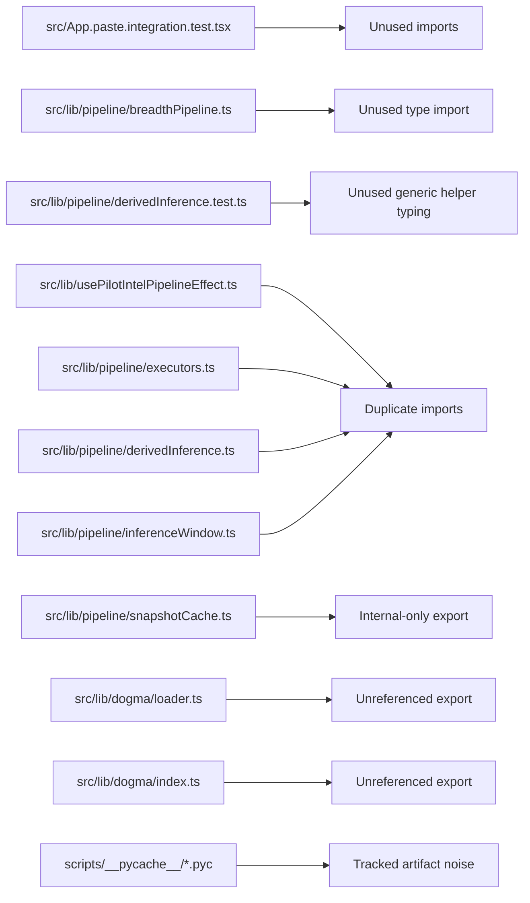

# Research Topic: Listed Findings Verification

Date: 2026-02-18

## Scope

Validate only the findings listed in `specs/refactor-nodejs-typescript-codebase/rough-idea.md`, excluding `./pyfa/**` and `./svcfitstat/**`.

## Evidence Summary

| # | Finding | Verification | Evidence |
| --- | --- | --- | --- |
| 1 | Unused imports in integration test | Confirmed | `src/App.paste.integration.test.tsx:11` (`fetchLatestKillsPaged`) and `src/App.paste.integration.test.tsx:13` (`fetchLatestLossesPaged`) are imported; no symbol references beyond import list/property keys in mock object. |
| 2 | Unused imported type in pipeline module | Confirmed | `type ZkillCharacterStats` is imported at `src/lib/pipeline/breadthPipeline.ts:7` and has no other occurrences in file. |
| 3 | Unused generic type parameter / arg in test helper typing | Confirmed | Test-local helper uses `<T>` at `src/lib/pipeline/derivedInference.test.ts:42`, `src/lib/pipeline/derivedInference.test.ts:74`, `src/lib/pipeline/derivedInference.test.ts:102` in a way that can trigger no-unused-parameter noise. |
| 4 | Duplicate imports from same module | Confirmed | `src/lib/usePilotIntelPipelineEffect.ts:1` + `src/lib/usePilotIntelPipelineEffect.ts:2` (`react`), `src/lib/pipeline/executors.ts:16` + `src/lib/pipeline/executors.ts:17` (`./constants`), `src/lib/pipeline/derivedInference.ts:2` + `src/lib/pipeline/derivedInference.ts:4` (`../cache`), `src/lib/pipeline/inferenceWindow.ts:1` + `src/lib/pipeline/inferenceWindow.ts:2` (`../api/esi`). |
| 5 | `buildPilotSnapshotKey` appears internal-only but exported | Confirmed | All occurrences are in one file: call sites at `src/lib/pipeline/snapshotCache.ts:19`, `src/lib/pipeline/snapshotCache.ts:39`, declaration at `src/lib/pipeline/snapshotCache.ts:57`. |
| 6 | Unreferenced exported `getDogmaVersion` | Confirmed | Only found at declaration `src/lib/dogma/loader.ts:17`; no in-repo call sites. |
| 7 | Unreferenced exported `getAttr` | Confirmed | Only found at declaration `src/lib/dogma/index.ts:55`; no in-repo call sites. |
| 8 | Tracked Python bytecode artifacts | Confirmed | `git ls-files` includes `scripts/__pycache__/pyfa_fitstats.cpython-311.pyc` and `scripts/__pycache__/pyfa_fitstats.cpython-314.pyc`. |

## Component Relationship Map

## Research Conclusion

All eight listed findings are reproducible from current source state and are valid candidates for behavior-preserving refactor work.
