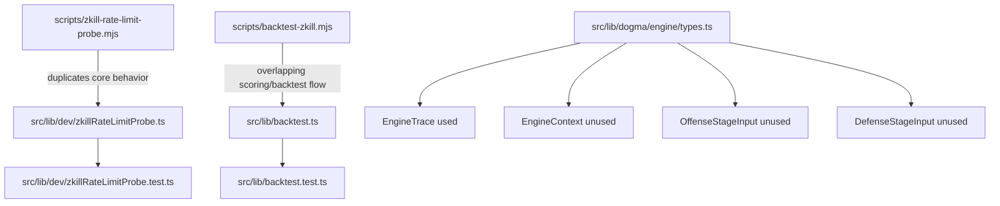

# Research Topic: Dead Code Candidate Verification

Date: 2026-02-18

## Scope

Verify the four candidates listed in rough idea section 4 and define removal safety criteria without implementation changes.

## Candidate Analysis

| Candidate | Current Reference Graph | Verification Result | Safe-Removal Criteria | Current Risk |
| --- | --- | --- | --- | --- |
| `scripts/zkill-rate-limit-probe.mjs` vs `src/lib/dev/zkillRateLimitProbe.ts` | Script is standalone (`scripts/zkill-rate-limit-probe.mjs:1` onward). TS module exports testable primitives (`src/lib/dev/zkillRateLimitProbe.ts:53`, `src/lib/dev/zkillRateLimitProbe.ts:220`) and is imported by `src/lib/dev/zkillRateLimitProbe.test.ts:8`. No `package.json` script references for rate-limit probe. | Duplicate capability is confirmed; TS module is tested, standalone script is not test-imported. | Choose one canonical implementation. If script remains entrypoint, convert it to a thin wrapper that delegates to one shared implementation. | Manual users may call script path directly; removing script abruptly can break undocumented local workflows. |
| `src/lib/dev/zkillRateLimitProbe.ts` appears test-only | In-repo import use is test-only (`src/lib/dev/zkillRateLimitProbe.test.ts:8`). No runtime src imports found. | Confirmed test-only within repository graph. | If removed, preserve tested behavior by moving tests to canonical implementation or removing obsolete feature entirely with explicit decision. | Removing TS module without migrating tests creates blind spots for probe behavior and parser logic. |
| `src/lib/backtest.ts` appears non-runtime while script exists | `src/lib/backtest.ts` exports `tuneScoringWeights` (`src/lib/backtest.ts:24`) and is imported by `src/lib/backtest.test.ts:2`. Runtime script path is separate (`package.json:30` -> `scripts/backtest-zkill.mjs`) with overlapping logic (`scripts/backtest-zkill.mjs:45`-`scripts/backtest-zkill.mjs:142`). | Confirmed split/duplicated backtest logic across script and TS module. | Decide canonical source (library-first recommended). Script should call library function to prevent divergence. | Behavior drift risk if both remain independent and only one path is covered by tests. |
| `src/lib/dogma/engine/types.ts` exports appear unused (`EngineContext`, `OffenseStageInput`, `DefenseStageInput`) | `EngineContext` (`src/lib/dogma/engine/types.ts:4`), `OffenseStageInput` (`src/lib/dogma/engine/types.ts:10`), `DefenseStageInput` (`src/lib/dogma/engine/types.ts:15`) have no in-repo references. `EngineTrace` is used by `src/lib/dogma/engine/pipeline.ts:1`. | Confirmed partial dead export surface; only `EngineTrace` is currently consumed. | Remove/de-export only unused types, retain `EngineTrace` export. | Low runtime risk (type-only surface), but medium API risk if downstream TypeScript consumers exist outside repo. User confirmed no external consumers. |

## Relationship Map

## Research Conclusion

All four candidates are valid for execution in this refactor, but each should be handled with explicit proof gates:

1. Canonicalize duplicate probe/backtest logic instead of deleting one side blindly.
2. Remove type-only dead exports where internal graph proves no usage.
3. Preserve behavior by forcing tests to follow the canonical path before any deletion.
