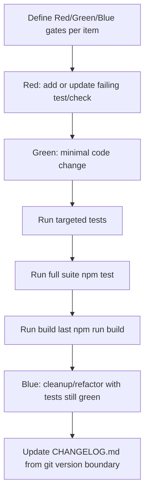

# Research Topic: Validation Gates and Workflow

Date: 2026-02-18

## Constraints Confirmed

- Behavior must not change.
- Use AGENTS-mandated TDD flow and validation sequence.
- Prefer strict static/compile checks, but avoid overly pedantic tooling expansion.
- Use existing project stack (Vitest + TypeScript + npm scripts), with minimal additional in-repo tests where needed.

## Recommended Gate Strategy

| Backlog Item | Red Gate | Green Gate | Blue Gate |
| --- | --- | --- | --- |
| 1. Unused imports/types/params | Run strict compile check with unused flags enabled (for example `npx tsc -p tsconfig.json --noEmit --noUnusedLocals --noUnusedParameters`) and confirm failure on listed files. | Minimal symbol removals/renames in listed files; targeted tests pass. | Normalize touched import ordering/naming only. |
| 2. Duplicate imports | Add static hygiene test in `scripts/tests` that fails when same module is imported more than once in a file; confirm failure on four known files. | Merge duplicate import blocks; hygiene test and targeted tests pass. | Keep explicit type/value import readability conventions consistent in touched files. |
| 3. Dead export surface + verified candidates | Add export-usage hygiene test (allowlist or graph check) that fails for known dead exports/candidates before edits. | Remove/de-export only verified-unused symbols and canonicalize duplicated logic paths. | Rename/internalize helpers for clearer boundaries after de-export. |
| 4. Tracked bytecode artifacts | Add repository hygiene test that fails if tracked files match `__pycache__` or `*.pyc`. | Remove tracked `.pyc` files and add precise ignore rule for scripts cache artifacts. | Keep ignore patterns narrow and documented. |

## AGENTS Validation Order (Must Preserve)

1. Targeted tests for touched area.
2. Full test suite: `npm test`.
3. Full build/compile verification last: `npm run build`.
4. Update `CHANGELOG.md` from version boundary history before closing.

## Gate Flow

## Research Conclusion

A strict-but-pragmatic path exists without adding new external dependencies: use TypeScript strict compile flags and new in-repo static hygiene tests under existing Vitest infrastructure.
