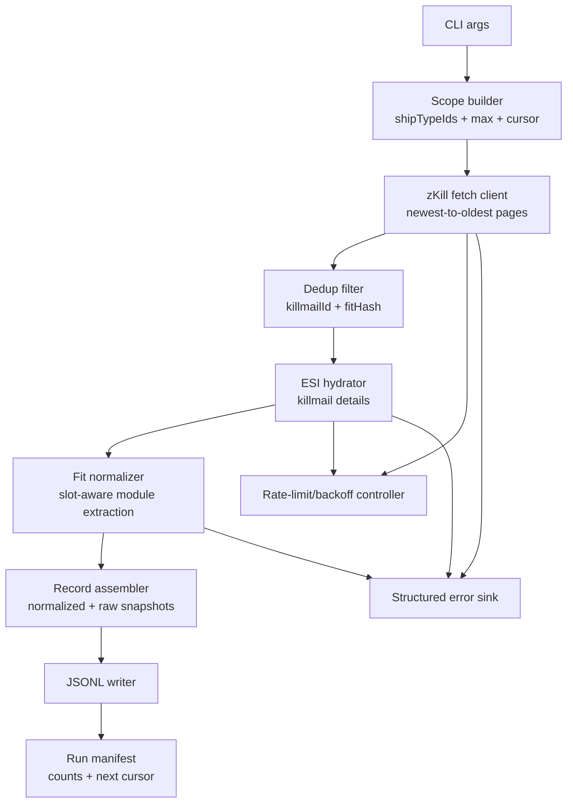
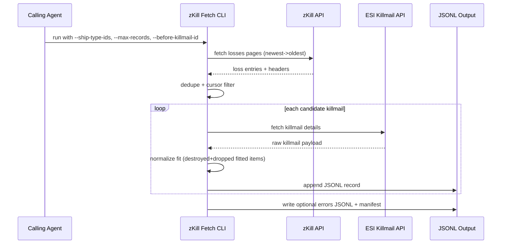

# zKill Fit Fetch CLI Design

## Overview
Build an agent-friendly CLI that fetches real zKill loss fits for selected ship type IDs and outputs normalized fit payloads (JSONL) for downstream parity and Dogma workflows.

v1 scope is fetch and normalization only. It does not compute pyfa stats, Dogma stats, or diffs.

Primary goals:
- Fetch by ship type filters (`type_id`), not pilot-centric inputs.
- Produce deterministic machine-readable JSONL records.
- Preserve full raw payloads for future rules/conditions.
- Handle rate limits and partial failures robustly.

## Detailed Requirements
Consolidated from `specs/zkill-fit-fetch-cli/requirements.md`.

1. Output only fit payloads in v1 (no pyfa/dogma/diff calculations).
2. Filter by ship type IDs (numeric `type_id` inputs), optimized for agent use.
3. Support multiple ship type IDs in one run.
4. Write JSONL output.
5. Deduplicate records.
6. Default max records per run is `200`.
7. Include both:
- normalized `fit` object for immediate dogma/parity ingestion
- full raw zKill/ESI payload snapshots for forward compatibility
8. On partial failures, skip bad records, emit structured errors, continue processing.
9. Handle zKill/Cloudflare rate limiting with retries/backoff; expose tuning flags.
10. In normalized fit, treat both destroyed and dropped fitted items as equipped when they were fitted by slot flag.
11. Preserve destruction/drop state details in raw payload only.
12. Ensure deterministic ordering newest-to-oldest.
13. Support optional `--before-killmail-id` cursor for predictable paging.

## Architecture Overview
The CLI is a deterministic data pipeline from ship filters to JSONL records and diagnostics.



## Components and Interfaces

### 1) CLI Interface
Proposed command shape:
- `node scripts/fetch-zkill-fits.mjs --ship-type-ids 29984,29986 --output data/parity/zkill-fits.jsonl`

Core flags:
- `--ship-type-ids <csv>` (required)
- `--max-records <n>` (default `200`)
- `--before-killmail-id <id>` (optional)
- `--output <path>` (required)
- `--errors-output <path>` (optional)
- `--manifest-output <path>` (optional)
- `--retry-max-attempts <n>`
- `--retry-base-ms <n>`
- `--retry-max-ms <n>`
- `--request-timeout-ms <n>`

### 2) zKill Fetch Client
Responsibilities:
- Fetch loss pages by ship type ID.
- Enforce newest-to-oldest traversal.
- Apply optional global cursor filter (`killmail_id < beforeKillmailId`).
- Surface response headers to backoff controller.

### 3) ESI Hydrator
Responsibilities:
- Resolve full killmail details (when hash is available).
- Return raw snapshot payload for archival.
- Emit recoverable errors on missing/unavailable killmails.

### 4) Fit Normalizer
Responsibilities:
- Convert killmail items into normalized slot-based fit structure.
- Include both dropped and destroyed fitted modules.
- Ignore non-fitted cargo for fitted-slot summaries while preserving all raw item data in snapshots.
- Produce canonical fit hash for dedupe.

### 5) Dedup Engine
Dedup keys:
- Primary: `killmail_id`
- Secondary: canonicalized `fitHash` (slot/type/charge normalized)

Behavior:
- Keep first deterministic occurrence in sorted stream.
- Report duplicate statistics in manifest.

### 6) Writers
- JSONL output writer for fit payload records.
- JSONL error writer for structured recoverable errors.
- Run manifest writer for summary and next cursor handoff.

## Data Models

### Normalized Fit Record (JSONL line)
```ts
{
  recordId: string; // "zkill-<killmail_id>"
  source: "zkill";
  killmailId: number;
  killmailTime: string; // ISO
  shipTypeId: number;
  shipTypeFilterId: number;
  zkillUrl: string;
  fit: {
    shipTypeId: number;
    slots: {
      high: Array<{ typeId: number; quantity: number; chargeTypeId?: number; chargeQuantity?: number }>;
      mid: Array<{ typeId: number; quantity: number; chargeTypeId?: number; chargeQuantity?: number }>;
      low: Array<{ typeId: number; quantity: number; chargeTypeId?: number; chargeQuantity?: number }>;
      rig: Array<{ typeId: number; quantity: number }>;
      subsystem: Array<{ typeId: number; quantity: number }>;
      otherFitted: Array<{ typeId: number; quantity: number }>;
    };
    fitHash: string;
  };
  raw: {
    zkill: unknown; // full zKill payload entry
    esi?: unknown; // full ESI killmail payload when available
  };
  fetchedAt: string;
}
```

### Structured Error Record (optional JSONL)
```ts
{
  at: string;
  stage: "zkill_fetch" | "esi_fetch" | "normalize" | "write";
  shipTypeId?: number;
  killmailId?: number;
  errorCode: string;
  message: string;
  retryable: boolean;
  attempt?: number;
  status?: number;
  headers?: Record<string, string>;
}
```

### Run Manifest
```ts
{
  generatedAt: string;
  input: {
    shipTypeIds: number[];
    maxRecords: number;
    beforeKillmailId?: number;
  };
  output: {
    recordsWritten: number;
    duplicatesSkipped: number;
    errorsLogged: number;
  };
  paging: {
    newestKillmailId?: number;
    oldestKillmailId?: number;
    nextBeforeKillmailId?: number;
  };
}
```

## Error Handling

1. Network/rate-limit errors:
- Retry with header-aware wait (Cloudflare/HTTP headers first, exponential backoff fallback).
- Emit structured error per failed terminal request.

2. Missing ESI killmail details:
- Log recoverable error and skip record if normalized fit cannot be safely derived.

3. Malformed item payloads:
- Log normalize-stage error and continue with remaining killmails.

4. Write errors:
- Output/manifest writer failures are fatal and terminate non-zero.

5. Partial success policy:
- Run succeeds when at least one valid record is produced and no fatal writer/config failure occurs.
- Recoverable per-record failures are summarized in manifest/errors output.

## Acceptance Criteria

1. Given valid `--ship-type-ids`, when the CLI runs, then it fetches losses for those ship type IDs and outputs JSONL fit payload records only.

2. Given no explicit `--max-records`, when the CLI runs, then it limits output to 200 records.

3. Given duplicate killmails or duplicate canonical fits, when records are assembled, then duplicates are removed deterministically.

4. Given dropped and destroyed fitted items, when fit normalization runs, then both are represented as fitted modules in normalized `fit` slots.

5. Given raw killmail data, when a record is written, then full raw snapshots are preserved under `raw`.

6. Given partial API/normalization failures, when processing continues, then valid records are still written and structured errors are emitted.

7. Given rate-limit responses and retry headers, when requests are retried, then backoff obeys header guidance before fallback backoff rules.

8. Given deterministic input conditions and identical upstream responses, when the CLI is rerun, then output order is stable newest-to-oldest.

9. Given `--before-killmail-id`, when the CLI runs, then output records all satisfy `killmailId < beforeKillmailId`.

10. Given completion of a run, when manifest output is enabled, then a manifest includes counts and `nextBeforeKillmailId` for the next page run.

## Testing Strategy
TDD red-green-blue is required.

Unit tests:
- CLI arg validation/defaults (`max=200`, required ship type IDs).
- Header-aware backoff decision logic.
- Slot flag to normalized slot-family mapping.
- Canonical fit hash generation and dedupe behavior.
- Deterministic ordering and cursor filter handling.

Integration tests (HTTP mocked fixtures):
- zKill pagination by ship filters.
- ESI hydration success/failure branches.
- End-to-end JSONL generation with mixed valid/invalid killmails.
- Structured error emission and manifest accuracy.

Regression tests:
- T3/subsystem-heavy examples ensure subsystem slot capture.
- Known malformed/missing payload patterns remain skip-and-log, not fail-fast.

Red/Green/Blue gates for implementation:
- Red gate: add failing tests for required behavior changes first.
- Green gate: implement minimal code to satisfy failing tests.
- Blue gate: refactor for clarity/reuse with tests still green.

## Appendices

### A) Technology Choices
- Node ESM CLI script in `scripts/` to match current repository tooling.
- JSONL for agent-friendly streaming and append workflows.
- Reuse existing parity conventions (`fitId`, ship type IDs, deterministic sorting).

### B) Research Findings (Codebase Baseline)
Observed baseline constraints in repo:
- Existing script `scripts/build-dogma-fit-corpus.mjs` fetches zKill losses but currently builds pseudo-EFT with placeholder type names.
- Parity and corpus workflows center on `data/parity/fit-corpus.jsonl` and deterministic fit IDs.
- This new CLI should replace/augment fetch quality while preserving compatibility with downstream parity workflows.

### C) Alternative Approaches Considered
1. Output only normalized fit without raw payloads.
- Rejected: conflicts with future dogma-condition expansion requirement.

2. Fail-fast on any fetch/normalize error.
- Rejected: conflicts with explicit skip-and-log continuation requirement.

3. Name/alias-based ship filters.
- Rejected for v1: numeric type IDs are more reliable for agent automation.

### D) Data-Flow Detail Diagram

